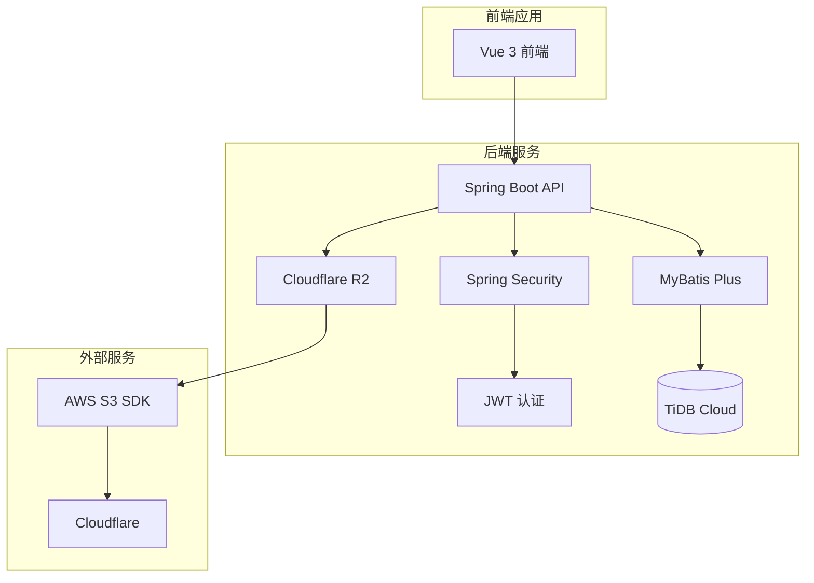
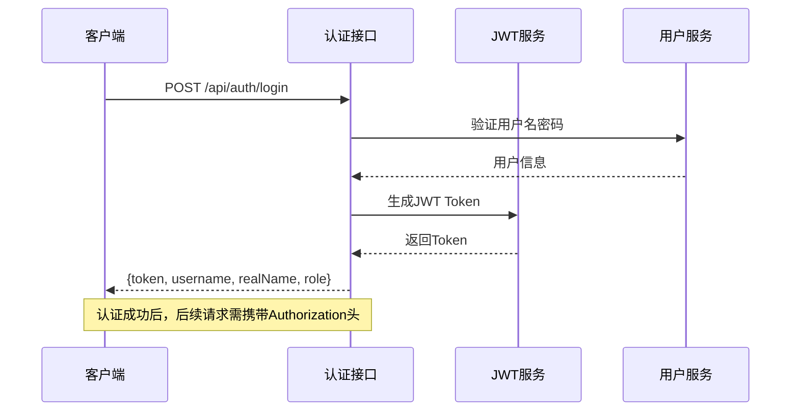
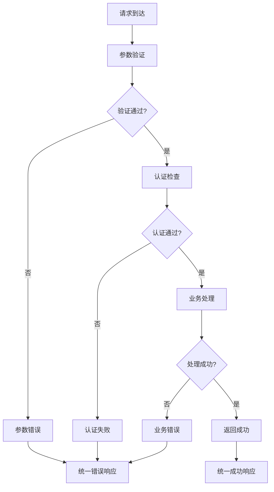
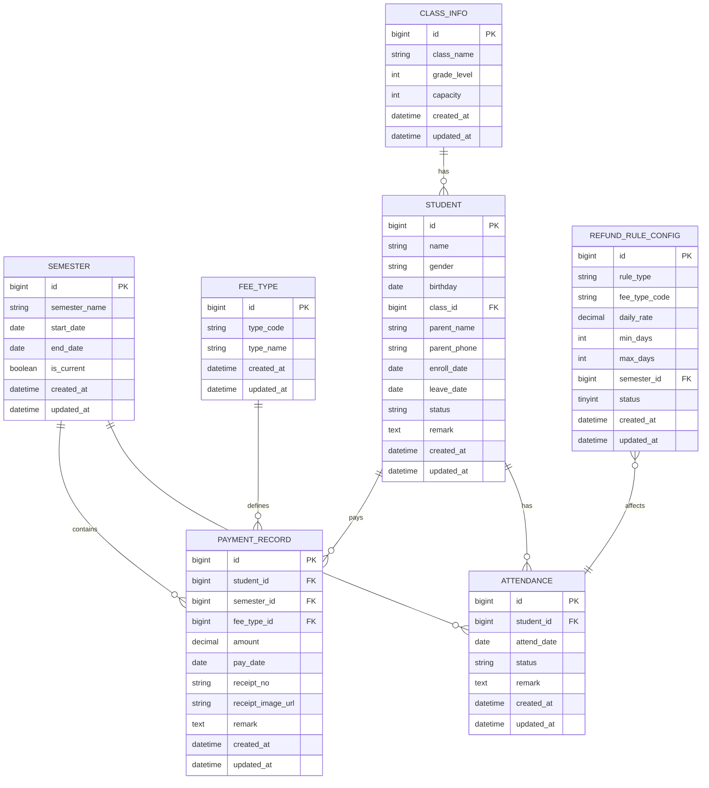

# 后端API接口设计

<cite>
**本文档引用的文件**
- [00-项目概览.md](file://docs/00-项目概览.md)
- [01-数据库设计-退费规则补充.md](file://docs/01-数据库设计-退费规则补充.md)
- [03-后端接口开发.md](file://docs/03-后端接口开发.md)
- [06-收据收费需求.md](file://docs/06-收据收费需求.md)
</cite>

## 目录
1. [项目概述](#项目概述)
2. [技术架构](#技术架构)
3. [认证与鉴权](#认证与鉴权)
4. [统一响应结构](#统一响应结构)
5. [错误码体系](#错误码体系)
6. [接口规范总览](#接口规范总览)
7. [详细接口文档](#详细接口文档)
8. [数据模型](#数据模型)
9. [API测试指南](#api测试指南)
10. [性能考虑](#性能考虑)
11. [故障排除](#故障排除)
12. [总结](#总结)

## 项目概述

kindergarten-system 是一个基于Spring Boot 3.2.x构建的幼儿园管理系统，采用前后端分离架构。系统旨在为幼儿园提供完整的信息化管理解决方案，涵盖学生管理、收费管理、考勤管理、统计报表等核心功能模块。

### 技术栈

**后端技术栈**
- Spring Boot 3.2.x - 主框架
- MyBatis Plus 3.5.x - ORM框架
- Spring Security 6.x - 认证授权
- JWT 0.12.x - Token认证
- TiDB Cloud - 云数据库
- Cloudflare R2 - 图片存储

**前端技术栈**
- Vue 3.x - 主框架
- Vite 5.x - 构建工具
- Element Plus 2.x - UI组件库
- Axios 1.x - HTTP请求
- Vue Router 4.x - 路由管理
- Pinia 2.x - 状态管理

### 功能模块

系统包含以下核心功能模块：
- 🔐 登录认证
- 👨‍🎓 学生管理
- 📅 学期管理
- 💰 费用类型管理
- 🧾 缴费记录（含收据图片）
- 📆 考勤管理
- 📊 统计面板
- 📊 学期收费汇总
- 💸 请假退费计算

## 技术架构



**架构图来源**
- [00-项目概览.md](file://docs/00-项目概览.md#L11-L22)

## 认证与鉴权

### 认证方式

系统采用JWT（JSON Web Token）作为认证方式，所有需要登录的接口都需要携带有效的Bearer Token。

### 认证流程



**认证流程图来源**
- [03-后端接口开发.md](file://docs/03-后端接口开发.md#L108-L121)

### 请求头规范

- **Authorization**: `Bearer <token>`
- **Content-Type**: `application/json`
- **Accept**: `application/json`

### 鉴权策略

- `/api/auth/login` - 无需认证
- 除登录接口外的所有接口 - 需要认证
- 权限控制基于用户角色（ADMIN等）

## 统一响应结构

系统采用统一的JSON响应格式，确保前后端交互的一致性。

### 响应格式

```json
{
  "code": 0,
  "message": "ok",
  "data": {}
}
```

### 字段说明

| 字段 | 类型 | 必填 | 说明 |
|------|------|------|------|
| code | number | 是 | 状态码，0表示成功 |
| message | string | 是 | 响应消息 |
| data | any | 否 | 返回的数据对象 |

### 状态码约定

- `code = 0`: 成功
- `code != 0`: 业务失败
- HTTP状态码建议：认证401，权限403，其余200+业务码

### 分页响应结构

```json
{
  "records": [],
  "page": 1,
  "pageSize": 10,
  "total": 123
}
```

**分页响应图来源**
- [03-后端接口开发.md](file://docs/03-后端接口开发.md#L60-L69)

## 错误码体系

系统定义了标准的错误码体系，便于统一处理各种异常情况。

### 错误码对照表

| code | 含义 | 说明 | HTTP状态码建议 |
|------|------|------|----------------|
| 0 | ok | 成功 | 200 |
| 10001 | 参数错误 | 校验失败 | 200 |
| 10002 | 数据不存在 | 例如id不存在 | 200 |
| 10003 | 状态不允许 | 例如删除当前学期等 | 200 |
| 20001 | 未登录/Token无效 | 对应401 | 401 |
| 20002 | 无权限 | 对应403 | 403 |
| 30001 | 文件上传失败 | R2/S3异常 | 200 |
| 90000 | 系统异常 | 未捕获异常 | 500 |

### 错误处理策略



**错误处理流程图来源**
- [03-后端接口开发.md](file://docs/03-后端接口开发.md#L83-L95)

## 接口规范总览

### 基础配置

- **Base URL**: `/api`
- **版本**: 建议使用文档版本标注（如 `v0.1`）
- **时间格式**: `yyyy-MM-dd HH:mm:ss`
- **日期格式**: `yyyy-MM-dd`

### 通用约定

1. **分页参数**:
   - `page`: 页码，从1开始
   - `pageSize`: 每页条数，默认10，最大100

2. **枚举状态**:
   - 学生状态: `active`(在读)/`inactive`(离园)
   - 考勤状态: `present`(出勤)/`absent`(缺勤)/`leave`(请假)

3. **文件上传**:
   - Content-Type: `multipart/form-data`
   - 参数: `file`
   - 限制: 大小(如5MB/10MB)、类型(jpg/png/webp/pdf)

**通用约定来源**
- [03-后端接口开发.md](file://docs/03-后端接口开发.md#L25-L80)

## 详细接口文档

### 认证模块

#### 登录接口

**POST /api/auth/login**

**请求参数**:
```json
{
  "username": "admin",
  "password": "***"
}
```

**响应数据**:
```json
{
  "token": "jwt...",
  "username": "admin",
  "realName": "管理员",
  "role": "ADMIN"
}
```

**接口来源**
- [03-后端接口开发.md](file://docs/03-后端接口开发.md#L108-L121)

### 班级管理模块

#### 班级列表

**GET /api/class/list**

**响应数据**: 班级列表数组

#### 新增班级

**POST /api/class/add**

**请求参数**: 班级基本信息

#### 修改班级

**PUT /api/class/update**

**请求参数**: 班级更新信息

#### 删除班级

**DELETE /api/class/{id}**

**接口来源**
- [03-后端接口开发.md](file://docs/03-后端接口开发.md#L122-L132)

### 学期管理模块

#### 学期列表

**GET /api/semester/list**

#### 新增学期

**POST /api/semester/add**

#### 修改学期

**PUT /api/semester/update**

#### 删除学期

**DELETE /api/semester/{id}**

#### 设置当前学期

**PUT /api/semester/setCurrent/{id}**

**接口来源**
- [03-后端接口开发.md](file://docs/03-后端接口开发.md#L133-L142)

### 费用类型模块

#### 费用类型列表

**GET /api/feeType/list**

#### 新增费用类型

**POST /api/feeType/add**

#### 修改费用类型

**PUT /api/feeType/update**

#### 删除费用类型

**DELETE /api/feeType/{id}**

**关键字段**: `type_code`(如 `meal`/`education`)用于退费规则映射

**接口来源**
- [03-后端接口开发.md](file://docs/03-后端接口开发.md#L143-L153)

### 学生管理模块

#### 分页查询学生

**GET /api/student/page**

**查询参数**:
- `page`: 页码
- `pageSize`: 每页数量
- `name`: 学生姓名(可选，模糊查询)
- `classId`: 班级ID(可选)
- `status`: 学生状态(可选)

**响应数据**: 分页结构

#### 学生详情

**GET /api/student/{id}**

#### 新增学生

**POST /api/student/add**

#### 修改学生

**PUT /api/student/update**

#### 修改学生状态

**PUT /api/student/status/{id}**

#### 删除学生

**DELETE /api/student/{id}**

**分页查询示例响应**:
```json
{
  "records": [
    {
      "id": 1,
      "name": "张三",
      "gender": "M",
      "birthday": "2020-01-01",
      "classId": 1,
      "className": "小班",
      "parentName": "张爸爸",
      "parentPhone": "138...",
      "enrollDate": "2023-09-01",
      "leaveDate": null,
      "status": "active",
      "remark": ""
    }
  ],
  "page": 1,
  "pageSize": 10,
  "total": 1
}
```

**接口来源**
- [03-后端接口开发.md](file://docs/03-后端接口开发.md#L154-L197)

### 图片上传模块

#### 上传收据图片

**POST /api/upload/image**

**请求参数**:
- `file`: 图片文件

**响应数据**:
```json
{
  "url": "https://.../receipts/2026/03/xxx.jpg",
  "key": "receipts/2026/03/xxx.jpg"
}
```

**接口来源**
- [03-后端接口开发.md](file://docs/03-后端接口开发.md#L198-L215)

### 缴费记录模块

#### 缴费记录列表

**GET /api/payment/page**

**查询参数**:
- `page`: 页码
- `pageSize`: 每页数量
- `studentName`: 学生姓名(可选，模糊查询)
- `studentId`: 学生ID(可选)
- `semesterId`: 学期ID(可选)
- `feeTypeId`: 费用类型ID(可选)
- `classId`: 班级ID(可选)
- `payDateFrom`: 付款日期起始(可选)
- `payDateTo`: 付款日期结束(可选)

#### 缴费记录详情

**GET /api/payment/{id}**

#### 学生缴费记录

**GET /api/payment/student/{studentId}**

#### 新增缴费记录

**POST /api/payment/add**

**请求参数**:
```json
{
  "studentId": 1,
  "semesterId": 1,
  "feeTypeId": 2,
  "amount": 500.00,
  "payDate": "2026-03-10",
  "receiptNo": "A0001",
  "receiptImageUrl": "https://...",
  "remark": ""
}
```

#### 修改缴费记录

**PUT /api/payment/update**

#### 删除缴费记录

**DELETE /api/payment/{id}**

**接口来源**
- [03-后端接口开发.md](file://docs/03-后端接口开发.md#L216-L253)

### 考勤管理模块

#### 考勤列表

**GET /api/attendance/list**

**查询参数**:
- `classId`: 班级ID(必填)
- `date`: 日期(必填，yyyy-MM-dd)

**响应数据**: 考勤记录数组

#### 批量保存考勤

**POST /api/attendance/save**

**请求参数**:
```json
{
  "classId": 1,
  "attendDate": "2026-03-10",
  "items": [
    { "studentId": 1, "status": "present", "remark": "" },
    { "studentId": 2, "status": "leave", "remark": "发烧" }
  ]
}
```

#### 学生维度统计

**GET /api/attendance/statByStudent**

#### 月维度统计

**GET /api/attendance/statByMonth**

**接口来源**
- [03-后端接口开发.md](file://docs/03-后端接口开发.md#L254-L298)

### 收费汇总模块

#### 学期汇总

**GET /api/fee/summary/semester/{semesterId}**

**响应数据示例**:
```json
{
  "semesterId": 1,
  "totalAmount": 12345.67,
  "byFeeType": [
    { "feeTypeId": 1, "feeTypeName": "学费", "typeCode": "education", "amount": 8000.00 },
    { "feeTypeId": 2, "feeTypeName": "餐费", "typeCode": "meal", "amount": 4000.00 }
  ]
}
```

#### 多学期对比

**GET /api/fee/summary/compare?semesterIds=1,2**

#### 按班级汇总

**GET /api/fee/summary/byClass?semesterId=1**

**接口来源**
- [03-后端接口开发.md](file://docs/03-后端接口开发.md#L299-L319)

### 退费计算模块

#### 退费计算

**GET /api/fee/refund/calculate?studentId=&semesterId=**

**查询参数**:
- `studentId`: 学生ID(必填)
- `semesterId`: 学期ID(必填)

**响应数据示例**:
```json
{
  "studentId": 1,
  "semesterId": 1,
  "leaveSegments": [
    {
      "startDate": "2026-03-01",
      "endDate": "2026-03-07",
      "days": 7,
      "matchedRuleType": "LEAVE_5_9",
      "refundItems": [
        { "feeTypeCode": "meal", "dailyRate": 12.7, "amount": 88.9 }
      ],
      "segmentAmount": 88.9
    }
  ],
  "totalAmount": 88.9
}
```

**退费规则**:
- 连续5-9天：仅退伙食费 = 12.7 × 天数
- 连续10天及以上：退保教费 = 66.3 × 天数，退伙食费 = 61.7 × 天数
- 不足5天：不退费

**接口来源**
- [03-后端接口开发.md](file://docs/03-后端接口开发.md#L320-L356)
- [06-收据收费需求.md](file://docs/06-收据收费需求.md#L63-L76)

### 首页统计模块

#### 首页概览

**GET /api/dashboard/overview**

**响应数据示例**:
```json
{
  "activeStudentCount": 120,
  "classStudentCounts": [
    { "classId": 1, "className": "小班", "count": 40 },
    { "classId": 2, "className": "中班", "count": 40 }
  ],
  "currentSemester": { "id": 1, "semesterName": "2026年春季" },
  "currentSemesterFeeTotal": 12345.67,
  "currentSemesterFeeByType": [
    { "typeCode": "education", "feeTypeName": "学费", "amount": 8000.00 },
    { "typeCode": "meal", "feeTypeName": "餐费", "amount": 4000.00 }
  ],
  "attendanceThisMonth": {
    "presentDays": 18,
    "leaveDays": 2,
    "absentDays": 1
  }
}
```

**接口来源**
- [03-后端接口开发.md](file://docs/03-后端接口开发.md#L360-L387)

## 数据模型

### 核心实体关系



**实体关系图来源**
- [01-数据库设计-退费规则补充.md](file://docs/01-数据库设计-退费规则补充.md#L9-L48)

### 退费规则配置

退费规则配置表用于维护可配置的退费参数：

| 字段名 | 类型 | 说明 |
|--------|------|------|
| id | BIGINT | 主键，自增 |
| rule_type | VARCHAR(20) | 规则类型：LEAVE_5_9 / LEAVE_10_PLUS |
| fee_type_code | VARCHAR(20) | 费用类型代码：meal / education |
| daily_rate | DECIMAL(10,2) | 日均费用（元/天） |
| min_days | INT | 最小天数 |
| max_days | INT | 最大天数（NULL表示无上限） |
| semester_id | BIGINT | 学期ID（NULL表示全局配置） |
| status | TINYINT | 状态：1启用 0禁用 |
| created_at | DATETIME | 创建时间 |
| updated_at | DATETIME | 更新时间 |

**退费规则配置来源**
- [01-数据库设计-退费规则补充.md](file://docs/01-数据库设计-退费规则补充.md#L9-L24)

## API测试指南

### 测试环境准备

1. **Postman配置**:
   - 设置Base URL为 `http://localhost:8080/api`
   - 在Headers中添加 `Content-Type: application/json`
   - 对需要认证的接口添加 `Authorization: Bearer <token>`

2. **测试数据准备**:
   - 准备测试用户账号
   - 准备基础数据（班级、学期、费用类型）
   - 准备测试图片文件

### 认证测试

1. **登录测试**:
   - POST `/api/auth/login`
   - 验证返回的token有效性
   - 使用token测试受保护接口

2. **权限测试**:
   - 测试未登录访问受保护接口
   - 测试无效token访问
   - 测试不同角色用户的权限

### 接口测试步骤

1. **基础数据测试**:
   - 班级管理：增删改查
   - 学期管理：设置当前学期
   - 费用类型管理：维护费用类型

2. **核心业务测试**:
   - 学生管理：完整CRUD操作
   - 缴费记录：上传图片、增删改查
   - 考勤管理：批量导入、统计查询

3. **高级功能测试**:
   - 收费汇总：按学期、班级、费用类型汇总
   - 退费计算：按考勤规则计算
   - 统计面板：首页数据聚合

### 调试技巧

1. **日志查看**:
   - 启用DEBUG级别日志
   - 关注SQL执行日志
   - 监控异常堆栈信息

2. **性能监控**:
   - 监控数据库查询性能
   - 关注接口响应时间
   - 分析缓存命中率

3. **常见问题排查**:
   - Token过期处理
   - 文件上传失败
   - 数据库连接异常

## 性能考虑

### 数据库优化

1. **索引策略**:
   - 为常用查询字段建立索引
   - 优化复合查询条件
   - 定期分析查询计划

2. **分页优化**:
   - 使用LIMIT和OFFSET
   - 避免深度分页
   - 考虑游标分页

### 缓存策略

1. **静态数据缓存**:
   - 班级、费用类型等基础数据
   - 用户权限信息
   - 配置参数

2. **查询结果缓存**:
   - 统计报表数据
   - 高频查询结果
   - 图片URL缓存

### 文件存储优化

1. **CDN加速**:
   - 图片文件使用CDN
   - 静态资源缓存
   - 压缩传输

2. **存储策略**:
   - 分桶存储
   - 生命周期管理
   - 成本优化

## 故障排除

### 常见错误及解决方案

1. **认证失败**:
   - 检查Token格式和有效期
   - 验证用户状态
   - 查看安全配置

2. **数据库连接异常**:
   - 检查连接池配置
   - 验证数据库状态
   - 查看慢查询日志

3. **文件上传失败**:
   - 检查文件大小限制
   - 验证文件类型
   - 查看存储服务状态

4. **接口超时**:
   - 优化SQL查询
   - 添加必要的索引
   - 考虑异步处理

### 监控指标

1. **系统监控**:
   - CPU和内存使用率
   - 数据库连接数
   - 磁盘空间使用

2. **应用监控**:
   - 接口响应时间
   - 错误率统计
   - 用户活跃度

3. **业务监控**:
   - 缴费成功率
   - 考勤准确率
   - 退费计算准确性

## 总结

kindergarten-system是一个功能完善的幼儿园管理系统，采用现代化的技术栈和设计模式。系统提供了完整的认证授权机制、统一的API接口规范和标准化的错误处理体系。

### 核心优势

1. **标准化接口**: 统一的响应格式和错误码体系
2. **完善的功能**: 涵盖幼儿园管理的各个业务环节
3. **可扩展性**: 模块化的架构设计，便于功能扩展
4. **安全性**: 基于JWT的认证机制和权限控制
5. **易用性**: 清晰的API文档和测试指南

### 发展建议

1. **持续优化**: 根据实际使用反馈持续改进接口设计
2. **性能提升**: 持续监控和优化系统性能
3. **功能扩展**: 根据业务需求逐步扩展新功能
4. **文档维护**: 保持API文档与代码实现同步更新

该系统为前端开发者提供了清晰的接口契约和集成指导，能够有效支撑幼儿园管理系统的开发和维护工作。