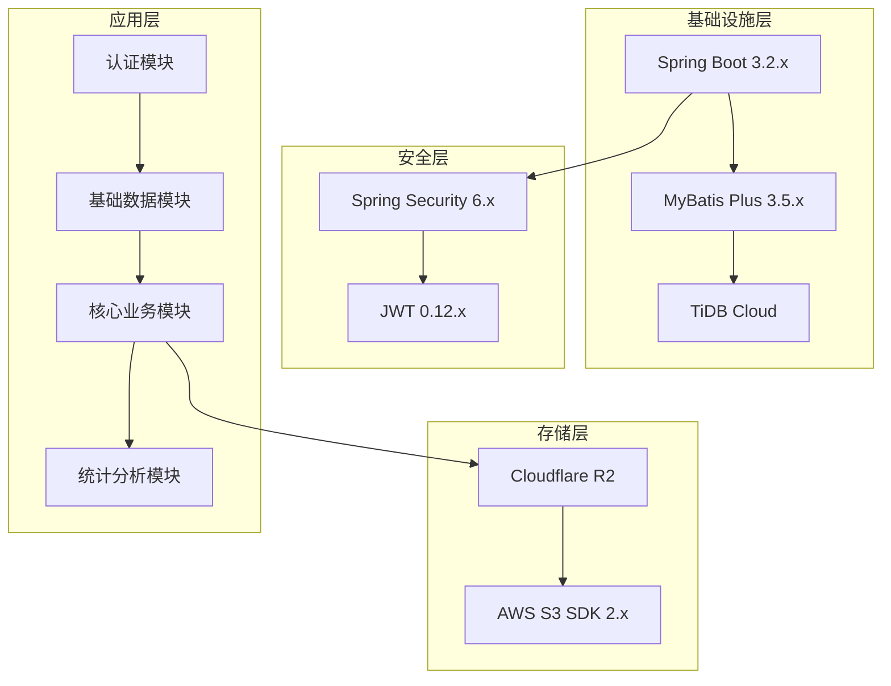
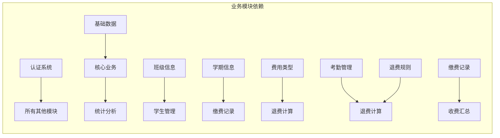
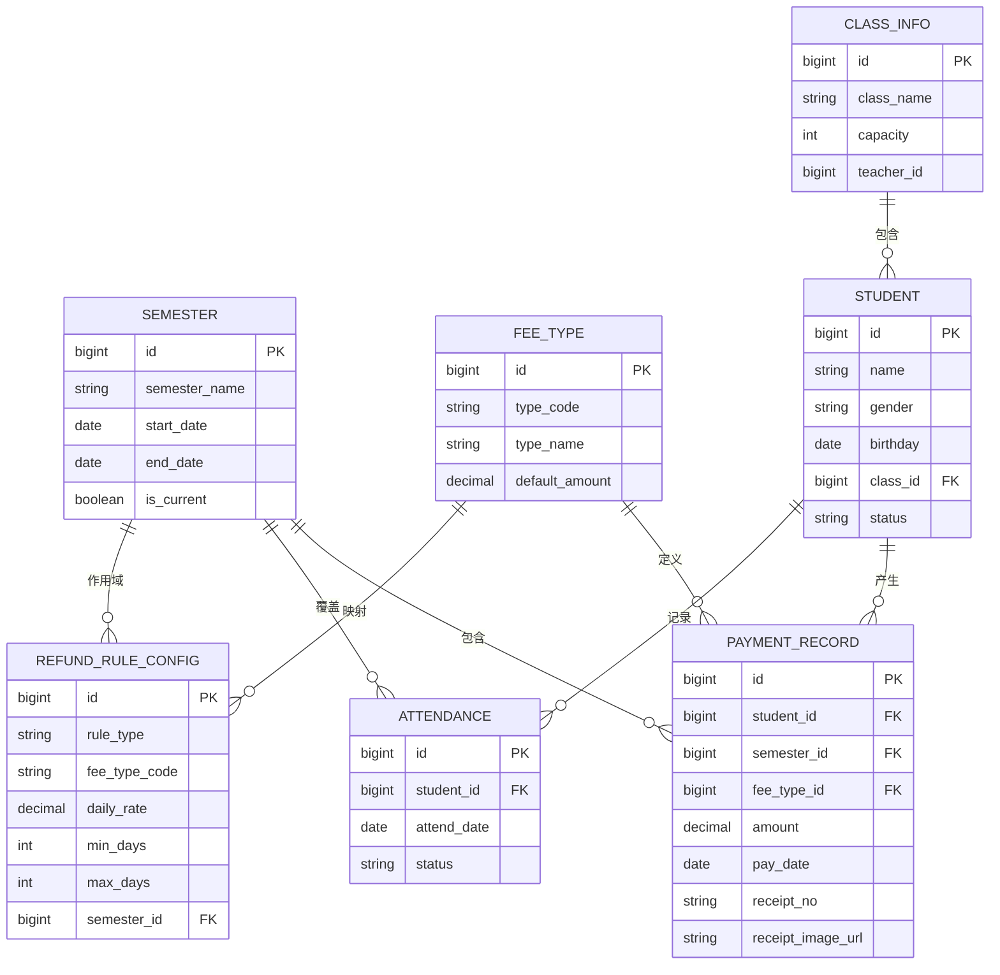

# 开发计划与进度

<cite>
**本文档引用的文件**
- [00-项目概览.md](file://docs/00-项目概览.md)
- [01-数据库设计-退费规则补充.md](file://docs/01-数据库设计-退费规则补充.md)
- [03-后端接口开发.md](file://docs/03-后端接口开发.md)
- [06-收据收费需求.md](file://docs/06-收据收费需求.md)
</cite>

## 目录
1. [项目概述](#项目概述)
2. [开发阶段划分](#开发阶段划分)
3. [详细开发计划](#详细开发计划)
4. [里程碑节点](#里程碑节点)
5. [交付物清单](#交付物清单)
6. [依赖关系分析](#依赖关系分析)
7. [风险评估与应对策略](#风险评估与应对策略)
8. [进度跟踪与监控](#进度跟踪与监控)
9. [质量保证措施](#质量保证措施)
10. [总结与建议](#总结与建议)

## 项目概述

### 项目基本信息
- **项目名称**：kindergarten-system
- **开发语言**：Java 17 + Vue 3
- **开发工具**：IntelliJ IDEA（内置JDK + Maven）
- **技术架构**：前后端分离架构

### 技术栈架构
**后端技术栈**
- Spring Boot 3.2.x - 主框架
- MyBatis Plus 3.5.x - ORM框架
- Spring Security 6.x - 认证授权
- JWT 0.12.x - Token认证
- TiDB Cloud - 云数据库
- Cloudflare R2 - 图片存储

**前端技术栈**
- Vue 3.x - 主框架
- Vite 5.x - 构建工具
- Element Plus 2.x - UI组件库
- Axios 1.x - HTTP请求
- Vue Router 4.x - 路由管理
- Pinia 2.x - 状态管理

### 核心功能模块
1. 🔐 登录认证
2. 👨‍🎓 学生管理
3. 📅 学期管理
4. 💰 费用类型管理
5. 🧾 缴费记录（含收据图片）
6. 📆 考勤管理
7. 📊 统计面板
8. 📊 学期收费汇总（本学期/上学期总收费、多学期对比）
9. 💸 请假退费计算（按考勤联动，支持 5–9 天、10天及以上退费规则）

## 开发阶段划分

基于项目需求和接口文档，将整个开发过程划分为6个主要阶段：

### 阶段一：项目初始化与基础设施搭建
**开发重点**：
- 项目环境配置与依赖管理
- 数据库连接配置
- 统一返回结构、异常处理、分页机制
- 基础开发框架搭建

**时间安排**：2-3周
**负责人**：后端开发工程师

### 阶段二：认证系统开发
**开发重点**：
- 用户登录认证功能
- JWT Token生成与验证
- 权限控制机制
- 安全策略实现

**时间安排**：1-2周
**负责人**：后端开发工程师

### 阶段三：基础数据管理模块
**开发重点**：
- 班级信息管理
- 学期信息管理
- 费用类型管理
- 学生信息管理
- 基础CRUD操作

**时间安排**：2-3周
**负责人**：后端开发工程师

### 阶段四：核心业务功能开发
**开发重点**：
- 收据图片上传与存储
- 缴费记录管理
- 收费汇总统计
- 请假退费计算
- 考勤管理

**时间安排**：4-5周
**负责人**：后端开发工程师

### 阶段五：高级功能开发
**开发重点**：
- 考勤录入与查询
- 多学期对比分析
- 班级维度统计
- 高级报表功能

**时间安排**：2-3周
**负责人**：后端开发工程师

### 阶段六：统计面板与优化
**开发重点**：
- 首页统计面板
- 性能优化
- 测试验证
- 部署准备

**时间安排**：1-2周
**负责人**：全栈团队

## 详细开发计划

### 阶段一：项目初始化与基础设施搭建（第1-3周）

#### 第1周：项目环境搭建
**开发任务**：
- 创建Spring Boot项目结构
- 配置Maven依赖管理
- 设置数据库连接配置
- 配置JWT认证基础框架
- 实现统一返回结构

**关键技术点**：
- Spring Boot自动配置
- MyBatis Plus集成
- 数据库连接池配置
- 全局异常处理机制

**预期成果**：
- 可运行的项目骨架
- 数据库连接正常
- 基础配置完成

#### 第2周：认证系统基础功能
**开发任务**：
- 用户实体模型设计
- 密码加密与验证
- JWT Token生成机制
- 认证中间件实现

**关键技术点**：
- Spring Security配置
- JWT Token生命周期管理
- 用户密码加密算法
- 认证拦截器实现

**预期成果**：
- 用户认证系统可用
- Token生成与验证功能
- 基础安全框架就绪

#### 第3周：基础设施完善
**开发任务**：
- 分页查询框架实现
- 日志系统配置
- 配置文件管理
- 开发环境调试工具

**关键技术点**：
- MyBatis Plus分页插件
- 日志级别配置
- 环境变量管理
- 开发工具链配置

**预期成果**：
- 完整的开发基础设施
- 统一的开发规范
- 调试工具就绪

### 阶段二：认证系统开发（第4-5周）

#### 第4周：用户认证核心功能
**开发任务**：
- 用户登录接口实现
- 用户信息查询
- 角色权限管理
- 会话管理机制

**关键技术点**：
- RESTful API设计
- 用户密码验证
- 角色权限控制
- 会话超时处理

**预期成果**：
- 完整的用户认证流程
- 权限控制系统
- 登录状态管理

#### 第5周：安全加固与优化
**开发任务**：
- CSRF防护机制
- 请求频率限制
- 安全审计日志
- 性能优化

**关键技术点**：
- Spring Security配置
- 速率限制算法
- 安全事件监控
- 缓存策略优化

**预期成果**：
- 安全可靠的认证系统
- 性能优化完成
- 安全审计就绪

### 阶段三：基础数据管理模块（第6-9周）

#### 第6周：班级信息管理
**开发任务**：
- 班级实体模型设计
- 班级CRUD接口实现
- 班级列表查询
- 班级状态管理

**关键技术点**：
- 实体类设计原则
- MyBatis Plus CRUD操作
- 查询条件构建
- 状态枚举管理

**预期成果**：
- 班级管理功能完整
- 数据验证机制
- 基础查询优化

#### 第7周：学期信息管理
**开发任务**：
- 学期实体模型设计
- 学期CRUD接口实现
- 当前学期设置
- 学期时间范围验证

**关键技术点**：
- 时间范围验证逻辑
- 学期唯一性约束
- 学期状态管理
- 数据一致性保证

**预期成果**：
- 学期管理功能完整
- 时间范围验证
- 学期状态控制

#### 第8周：费用类型管理
**开发任务**：
- 费用类型实体设计
- 费用类型CRUD实现
- 费用类型代码管理
- 费用类型查询优化

**关键技术点**：
- 费用类型代码规范
- 类型映射关系
- 查询性能优化
- 数据完整性约束

**预期成果**：
- 费用类型管理完整
- 类型代码标准化
- 查询效率优化

#### 第9周：学生信息管理
**开发任务**：
- 学生实体模型设计
- 学生CRUD接口实现
- 学生分页查询
- 学生状态管理
- 学生信息关联查询

**关键技术点**：
- 学生信息关联设计
- 分页查询优化
- 状态枚举管理
- 数据验证规则

**预期成果**：
- 学生管理功能完整
- 关联查询优化
- 状态管理机制

### 阶段四：核心业务功能开发（第10-15周）

#### 第10周：收据图片上传功能
**开发任务**：
- 图片上传接口实现
- Cloudflare R2存储集成
- 文件类型验证
- 上传权限控制

**关键技术点**：
- AWS S3 SDK集成
- 文件上传流处理
- 存储路径管理
- 文件访问权限控制

**预期成果**：
- 图片上传功能完整
- R2存储集成完成
- 文件安全验证

#### 第11周：缴费记录管理
**开发任务**：
- 缴费记录实体设计
- 缴费记录CRUD实现
- 缴费记录分页查询
- 缴费记录搜索过滤
- 缴费记录详情展示

**关键技术点**：
- 缴费记录关联查询
- 多条件搜索实现
- 分页查询优化
- 数据展示格式化

**预期成果**：
- 缴费记录管理完整
- 多条件查询功能
- 数据展示优化

#### 第12周：收费汇总统计功能
**开发任务**：
- 学期收费汇总实现
- 多学期对比功能
- 按班级汇总功能
- 按费用类型汇总功能

**关键技术点**：
- 聚合查询优化
- 多维度统计分析
- 数据分组逻辑
- 性能优化策略

**预期成果**：
- 收费汇总功能完整
- 多维度统计分析
- 性能优化完成

#### 第13周：请假退费计算功能
**开发任务**：
- 退费规则配置管理
- 退费计算算法实现
- 连续请假区间识别
- 退费明细计算

**关键技术点**：
- 退费规则配置表设计
- 连续请假区间算法
- 多规则退费计算
- 精度控制与舍入

**预期成果**：
- 退费计算功能完整
- 规则配置管理
- 算法准确性验证

#### 第14周：考勤管理功能
**开发任务**：
- 考勤记录实体设计
- 考勤批量保存实现
- 考勤查询统计
- 考勤状态管理

**关键技术点**：
- 批量数据处理
- 考勤状态枚举
- 统计查询优化
- 数据一致性保证

**预期成果**：
- 考勤管理功能完整
- 批量处理能力
- 统计查询优化

#### 第15周：功能整合与优化
**开发任务**：
- 各模块功能整合
- 性能优化与测试
- Bug修复与改进
- 文档完善

**关键技术点**：
- 模块间数据交互
- 性能瓶颈识别
- 回归测试执行
- 代码质量检查

**预期成果**：
- 功能整合完成
- 性能优化完成
- 测试覆盖完整

### 阶段五：高级功能开发（第16-18周）

#### 第16周：高级统计功能
**开发任务**：
- 月度统计分析
- 学生维度统计
- 班级维度统计
- 多维度交叉分析

**关键技术点**：
- 复杂查询优化
- 统计算法实现
- 数据聚合策略
- 报表生成机制

**预期成果**：
- 高级统计功能完整
- 多维度分析能力
- 报表生成优化

#### 第17周：多学期对比分析
**开发任务**：
- 多学期数据对比
- 时间序列分析
- 趋势预测功能
- 数据可视化支持

**关键技术点**：
- 多学期数据处理
- 时间序列算法
- 趋势分析模型
- 可视化数据准备

**预期成果**：
- 多学期对比功能
- 趋势分析能力
- 数据可视化支持

#### 第18周：高级报表功能
**开发任务**：
- 自定义报表生成
- 报表模板管理
- 报表导出功能
- 报表权限控制

**关键技术点**：
- 报表模板引擎
- 数据导出格式
- 报表权限管理
- 性能优化策略

**预期成果**：
- 高级报表功能完整
- 模板管理机制
- 多格式导出支持

### 阶段六：统计面板与优化（第19-20周）

#### 第19周：首页统计面板
**开发任务**：
- 首页概览数据准备
- 统计图表实现
- 实时数据更新
- 响应式设计

**关键技术点**：
- 综合统计数据聚合
- 图表渲染优化
- 实时数据同步
- 移动端适配

**预期成果**：
- 首页统计面板完整
- 图表展示效果
- 实时数据更新

#### 第20周：性能优化与部署准备
**开发任务**：
- 系统性能优化
- 内存使用优化
- 数据库查询优化
- 部署环境准备

**关键技术点**：
- 性能瓶颈识别
- 缓存策略优化
- 数据库索引优化
- 部署脚本编写

**预期成果**：
- 系统性能达标
- 部署环境就绪
- 性能监控准备

## 里程碑节点

### 里程碑一：核心功能完成（第15周末）
**目标**：完成所有核心业务功能开发
**关键指标**：
- 所有模块接口开发完成
- 数据库表结构完整
- 核心业务逻辑验证
- 单元测试覆盖率≥80%

**交付物**：
- 完整的后端API接口
- 数据库Schema
- 单元测试报告
- 接口文档

### 里程碑二：高级功能完成（第18周末）
**目标**：完成所有高级功能开发
**关键指标**：
- 高级统计功能完成
- 多学期对比功能
- 高级报表功能
- 性能基准测试

**交付物**：
- 高级功能模块
- 性能测试报告
- 用户手册
- 部署指南

### 里程碑三：系统验收（第20周末）
**目标**：完成系统最终验收
**关键指标**：
- 所有功能测试通过
- 性能指标达标
- 安全测试完成
- 用户验收通过

**交付物**：
- 最终系统版本
- 测试验收报告
- 用户培训材料
- 维护手册

## 交付物清单

### 开发阶段交付物

#### 阶段一交付物
- 项目骨架代码
- 数据库连接配置
- 基础认证框架
- 开发环境配置

#### 阶段二交付物
- 用户认证系统
- 权限控制机制
- 安全配置文件
- 认证接口文档

#### 阶段三交付物
- 基础数据管理模块
- 实体模型设计
- CRUD接口实现
- 数据验证规则

#### 阶段四交付物
- 核心业务功能
- 收据上传功能
- 缴费记录管理
- 退费计算功能
- 考勤管理功能

#### 阶段五交付物
- 高级统计功能
- 多学期对比
- 高级报表功能
- 性能优化报告

#### 阶段六交付物
- 统计面板功能
- 首页概览界面
- 系统优化完成
- 部署准备就绪

### 质量保证交付物
- 单元测试代码
- 集成测试报告
- 性能测试报告
- 安全测试报告
- 用户验收测试报告

### 文档交付物
- 技术设计文档
- API接口文档
- 用户操作手册
- 部署维护手册
- 测试用例文档

## 依赖关系分析

### 技术依赖关系

**图表来源**
- [00-项目概览.md](file://docs/00-项目概览.md#L9-L41)
- [03-后端接口开发.md](file://docs/03-后端接口开发.md#L102-L152)

### 业务依赖关系

**图表来源**
- [03-后端接口开发.md](file://docs/03-后端接口开发.md#L403-L410)
- [06-收据收费需求.md](file://docs/06-收据收费需求.md#L19-L19)

### 数据依赖关系

**图表来源**
- [01-数据库设计-退费规则补充.md](file://docs/01-数据库设计-退费规则补充.md#L10-L24)
- [06-收据收费需求.md](file://docs/06-收据收费需求.md#L92-L109)

## 风险评估与应对策略

### 技术风险

#### 风险一：数据库性能问题
**风险描述**：随着数据量增长，查询性能可能下降
**影响程度**：高
**应对策略**：
- 设计合理的索引策略
- 实施查询优化
- 建立缓存机制
- 定期性能监控

#### 风险二：并发访问冲突
**风险描述**：多用户同时操作可能导致数据不一致
**影响程度**：中
**应对策略**：
- 实施乐观锁机制
- 使用事务管理
- 建立数据校验规则
- 实施重试机制

#### 风险三：文件存储可靠性
**风险描述**：Cloudflare R2存储可能出现故障
**影响程度**：中
**应对策略**：
- 实施备份策略
- 建立容灾机制
- 监控存储健康状态
- 准备降级方案

### 业务风险

#### 风险四：需求变更频繁
**风险描述**：业务需求可能频繁变更
**影响程度**：中
**应对策略**：
- 建立需求变更流程
- 实施敏捷开发方法
- 保持接口向后兼容
- 及时更新技术文档

#### 风险五：用户接受度低
**风险描述**：用户可能不适应新系统
**影响程度**：中
**应对策略**：
- 加强用户培训
- 提供详细文档
- 建立反馈机制
- 实施渐进式推广

### 进度风险

#### 风险六：开发延期
**风险描述**：可能因各种原因导致开发延期
**影响程度**：高
**应对策略**：
- 制定详细的进度计划
- 建立里程碑检查点
- 实施风险管理
- 准备应急计划

#### 风险七：技术债务积累
**风险描述**：为赶进度可能产生技术债务
**影响程度**：中
**应对策略**：
- 实施代码审查制度
- 定期重构优化
- 建立技术债务跟踪
- 平衡进度与质量

## 进度跟踪与监控

### 关键绩效指标(KPI)

#### 开发进度指标
- **功能完成率**：已完成功能占总功能的比例
- **代码覆盖率**：单元测试覆盖的代码比例
- **缺陷密度**：每千行代码的缺陷数量
- **需求变更次数**：项目期间需求变更的总次数

#### 质量指标
- **缺陷发现率**：测试阶段发现的缺陷数量
- **缺陷修复率**：已修复缺陷占总缺陷的比例
- **用户满意度**：用户对系统的满意程度
- **系统稳定性**：系统正常运行时间比例

#### 性能指标
- **响应时间**：系统平均响应时间
- **吞吐量**：系统每秒处理的请求数
- **并发用户数**：系统支持的最大并发用户数
- **资源利用率**：CPU、内存、磁盘等资源使用率

### 监控工具与方法

#### 代码质量监控
- **静态代码分析**：使用SonarQube进行代码质量检查
- **单元测试覆盖率**：使用JaCoCo统计测试覆盖率
- **代码复杂度分析**：监控代码圈复杂度
- **重复代码检测**：识别和清理重复代码

#### 性能监控
- **APM工具**：使用New Relic或类似工具监控应用性能
- **数据库监控**：监控SQL执行时间和慢查询
- **缓存监控**：监控缓存命中率和性能
- **文件存储监控**：监控R2存储使用情况

#### 用户体验监控
- **用户行为分析**：使用Google Analytics跟踪用户行为
- **错误日志监控**：实时监控系统错误和异常
- **性能告警**：设置性能阈值告警
- **用户反馈收集**：建立用户反馈收集机制

### 里程碑检查机制

#### 周度检查
- **周一**：上周工作总结和本周计划
- **周五**：本周工作进度检查
- **关键指标**：功能完成率、缺陷密度、代码覆盖率

#### 月度评估
- **月度回顾**：整体进度评估和问题分析
- **风险评估**：识别新的风险和应对措施
- **资源调整**：根据实际情况调整资源配置
- **计划修订**：必要时修订项目计划

#### 季度评审
- **季度总结**：阶段性成果评估
- **质量评审**：代码质量和系统质量评审
- **用户验收**：重要功能的用户验收测试
- **持续改进**：总结经验教训，持续改进

## 质量保证措施

### 代码质量保证

#### 代码规范
- **编码标准**：制定统一的编码规范和最佳实践
- **代码审查**：实施严格的代码审查制度
- **静态分析**：使用工具进行代码静态分析
- **自动化检查**：集成CI/CD进行自动化质量检查

#### 测试策略
- **单元测试**：每个功能模块至少100%单元测试覆盖率
- **集成测试**：模块间集成测试和接口测试
- **系统测试**：完整的系统功能测试
- **性能测试**：压力测试和性能基准测试
- **安全测试**：安全漏洞扫描和渗透测试

#### 质量度量
- **代码质量指标**：圈复杂度、代码行数、注释率
- **缺陷管理**：缺陷跟踪和修复流程
- **回归测试**：每次修改后的回归测试
- **质量报告**：定期生成质量报告和趋势分析

### 测试执行策略

#### 测试环境管理
- **环境隔离**：开发、测试、预生产、生产环境分离
- **数据管理**：测试数据的生成、管理和清理
- **环境配置**：各环境的配置管理和版本控制
- **环境监控**：环境健康状态监控和告警

#### 自动化测试
- **测试框架**：使用JUnit、Mockito等测试框架
- **测试数据**：自动化测试数据生成和管理
- **测试执行**：CI/CD流水线中的自动化测试执行
- **测试报告**：自动化测试结果报告和分析

#### 手工测试
- **探索性测试**：针对复杂场景的手工探索性测试
- **用户体验测试**：真实用户场景的用户体验测试
- **兼容性测试**：不同浏览器和设备的兼容性测试
- **回归测试**：重要功能的回归测试验证

## 总结与建议

### 项目总结

本开发计划基于项目的实际需求和技术架构，制定了详细的开发阶段划分、时间安排和质量保证措施。通过合理的阶段划分和里程碑设置，可以有效控制项目风险，确保按时高质量地完成项目目标。

### 关键成功因素

1. **明确的需求管理**：建立完善的需求变更流程和版本控制机制
2. **严格的质量保证**：实施全面的质量保证措施和测试策略
3. **有效的风险管理**：识别潜在风险并制定相应的应对策略
4. **持续的进度监控**：建立完善的进度跟踪和监控机制
5. **团队协作配合**：加强团队沟通和协作，提高开发效率

### 建议与展望

#### 技术发展建议
- **微服务架构**：考虑未来向微服务架构演进的可能性
- **容器化部署**：采用Docker和Kubernetes进行容器化部署
- **云原生技术**：利用云原生技术提升系统弹性和可扩展性
- **AI辅助开发**：探索AI在代码生成和测试方面的应用

#### 业务发展建议
- **功能扩展**：根据用户反馈持续扩展系统功能
- **性能优化**：持续进行性能优化和系统调优
- **用户体验**：不断改善用户体验和界面设计
- **安全保障**：加强系统安全防护和数据保护

#### 团队建设建议
- **技能提升**：定期组织技术培训和分享活动
- **知识管理**：建立完善的知识管理体系和文档标准
- **团队协作**：加强团队协作和沟通机制
- **激励机制**：建立合理的激励机制和职业发展通道

通过严格执行本开发计划，相信能够按时高质量地完成幼儿园管理系统的开发工作，为用户提供一个功能完善、性能稳定、易于使用的管理系统。