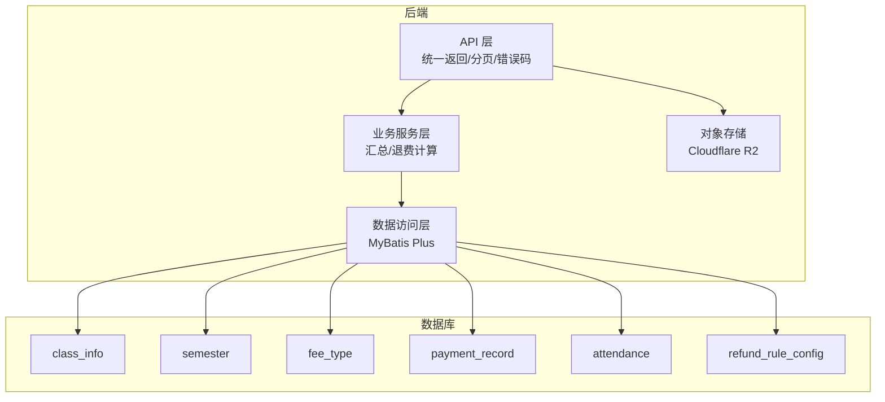
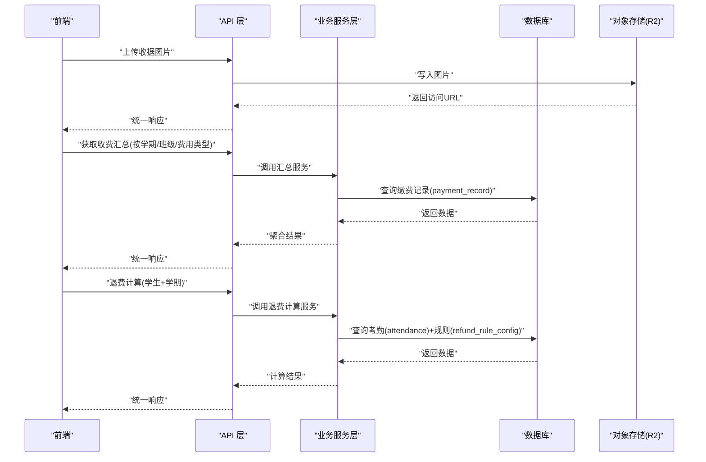
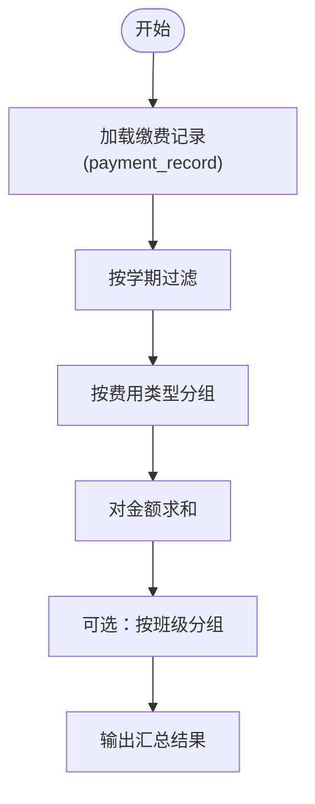
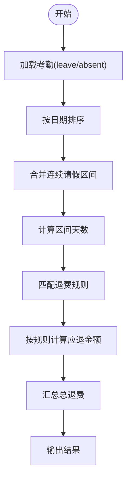
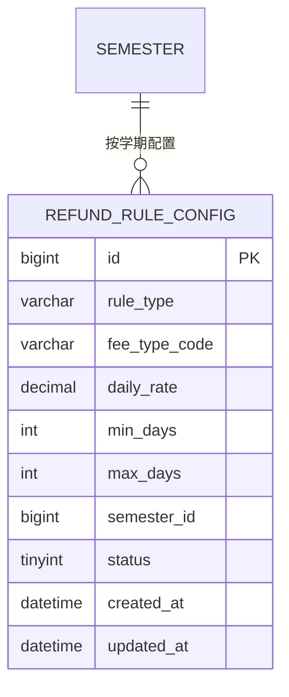
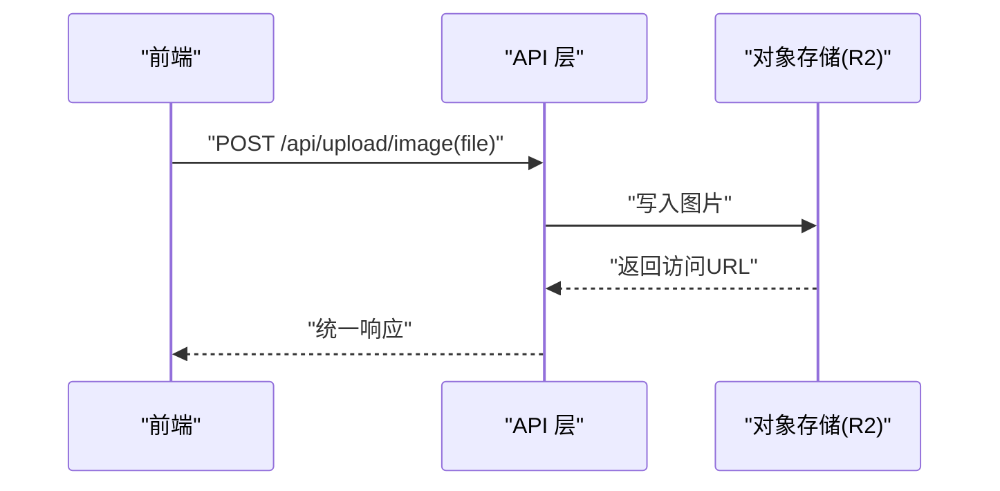
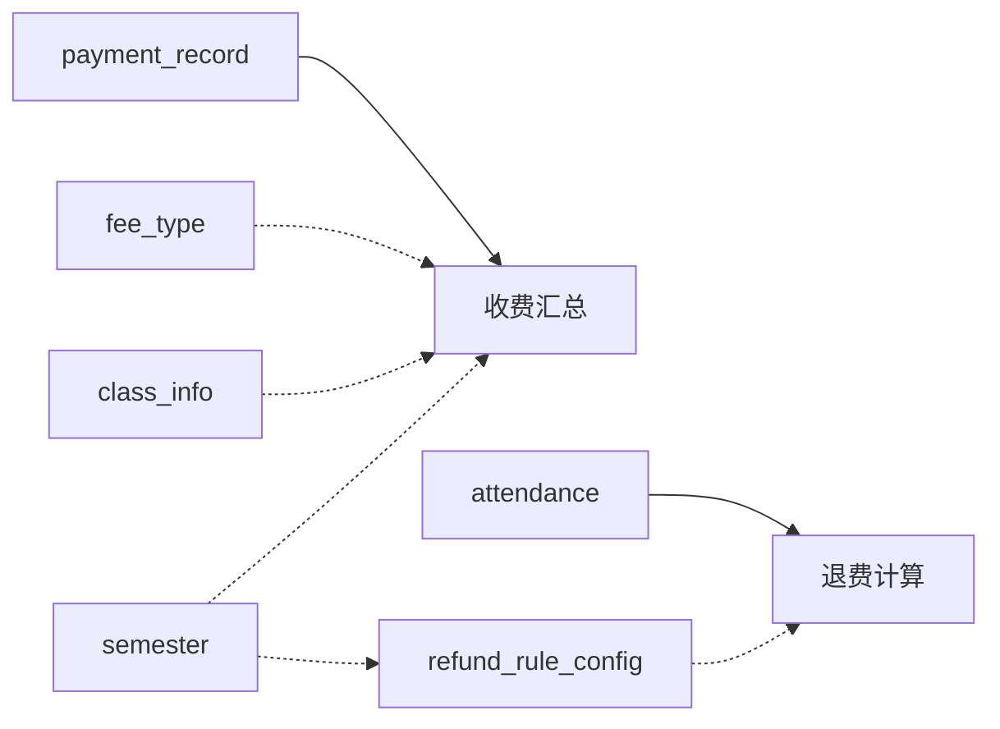

# 收据收费需求

<cite>
**本文引用的文件**
- [06-收据收费需求.md](file://docs/06-收据收费需求.md)
- [03-后端接口开发.md](file://docs/03-后端接口开发.md)
- [01-数据库设计-退费规则补充.md](file://docs/01-数据库设计-退费规则补充.md)
- [00-项目概览.md](file://docs/00-项目概览.md)
</cite>

## 目录
1. [简介](#简介)
2. [项目结构](#项目结构)
3. [核心组件](#核心组件)
4. [架构总览](#架构总览)
5. [详细组件分析](#详细组件分析)
6. [依赖分析](#依赖分析)
7. [性能考虑](#性能考虑)
8. [故障排查指南](#故障排查指南)
9. [结论](#结论)
10. [附录](#附录)

## 简介
本需求文档面向“缴费&收据管理模块”的补充能力，聚焦以下目标：
- 收费汇总：按学期/班级/费用类型进行统计，支持多学期对比分析
- 退费计算：基于考勤联动，按请假天数自动计算应退金额，覆盖5–9天与10天及以上两类规则
- 退费规则配置：支持按学期/全局配置日均费用参数，便于灵活调整
- 与考勤系统的联动：通过连续请假区间识别，驱动退费计算
- 业务流程图与数据流转说明：帮助产品经理与开发团队理解端到端流程

## 项目结构
本仓库为后端 API 工程，采用 Spring Boot + MyBatis Plus + TiDB/MySQL8 + Cloudflare R2（S3 SDK）实现，前后端分离协作。后端负责：
- 认证与鉴权（JWT）
- 数据访问（MyBatis Plus）
- 收据图片上传（R2/S3）
- 收费汇总与退费计算（基于考勤与规则配置）
- 联动考勤统计与首页概览

图表来源
- [00-项目概览.md](file://docs/00-项目概览.md#L9-L42)
- [03-后端接口开发.md](file://docs/03-后端接口开发.md#L11-L16)

章节来源
- [00-项目概览.md](file://docs/00-项目概览.md#L1-L54)
- [03-后端接口开发.md](file://docs/03-后端接口开发.md#L1-L420)

## 核心组件
- 收费汇总（学期/班级/费用类型）
  - 基于缴费记录表按学期聚合，支持按费用类型与班级分组
  - 提供多学期对比接口
- 退费计算（按请假天数联动考勤）
  - 基于考勤表识别连续请假区间，匹配退费规则配置表，计算应退金额
  - 支持5–9天仅退伙食费、10天及以上退保教费+伙食费
- 退费规则配置（可选）
  - 支持按学期/全局配置日均费用参数，便于后续调整
- 收据图片上传
  - 上传至 R2，返回访问 URL

章节来源
- [06-收据收费需求.md](file://docs/06-收据收费需求.md#L42-L76)
- [03-后端接口开发.md](file://docs/03-后端接口开发.md#L299-L359)
- [01-数据库设计-退费规则补充.md](file://docs/01-数据库设计-退费规则补充.md#L5-L49)

## 架构总览
后端通过 API 层暴露统一接口，业务服务层负责汇总与退费计算，DAO 层通过 MyBatis Plus 访问数据库，对象存储使用 Cloudflare R2。核心数据流如下：

图表来源
- [03-后端接口开发.md](file://docs/03-后端接口开发.md#L198-L359)
- [01-数据库设计-退费规则补充.md](file://docs/01-数据库设计-退费规则补充.md#L36-L41)

## 详细组件分析

### 组件A：收费汇总（学期/班级/费用类型）
- 功能要点
  - 按学期汇总总收费，并按费用类型分组
  - 支持多学期对比
  - 支持按班级汇总
- 数据来源
  - 主表：缴费记录表（payment_record）
  - 关联：学生→班级（class_info）、费用类型（fee_type）
- 计算逻辑
  - 以 payment_record 为主，按 semester_id 筛选，对 amount 求和
  - 可选按 fee_type_id、class_id 分组
- 接口
  - 获取学期汇总：按学期+费用类型分组
  - 多学期对比：传入多个学期 ID
  - 按班级汇总：传入 semesterId

图表来源
- [06-收据收费需求.md](file://docs/06-收据收费需求.md#L42-L54)
- [03-后端接口开发.md](file://docs/03-后端接口开发.md#L299-L318)

章节来源
- [06-收据收费需求.md](file://docs/06-收据收费需求.md#L42-L54)
- [03-后端接口开发.md](file://docs/03-后端接口开发.md#L299-L318)

### 组件B：退费计算（请假联动）
- 功能要点
  - 基于考勤表识别连续请假区间（leave/absent）
  - 匹配退费规则配置表，按天数与费用类型计算应退金额
  - 支持5–9天仅退伙食费、10天及以上退保教费+伙食费
- 数据来源
  - 考勤表（attendance）：status IN ('leave','absent')
  - 退费规则配置表（refund_rule_config）：按学期/全局配置日均费用
  - 费用类型（fee_type）：type_code 映射 meal/education
- 计算逻辑
  - 连续请假区间合并：相邻日期差为1天的请假合并为一个区间
  - 区间天数判定：
    - 5–9天：仅退伙食费 = 12.7 × 天数
    - 10天及以上：退保教费 = 66.3 × 天数，退伙食费 = 61.7 × 天数
  - 不足5天不退费
- 接口
  - 退费计算：传入 studentId 与 semesterId，返回连续请假区间与退费明细

图表来源
- [06-收据收费需求.md](file://docs/06-收据收费需求.md#L57-L76)
- [01-数据库设计-退费规则补充.md](file://docs/01-数据库设计-退费规则补充.md#L36-L41)

章节来源
- [06-收据收费需求.md](file://docs/06-收据收费需求.md#L57-L76)
- [03-后端接口开发.md](file://docs/03-后端接口开发.md#L320-L359)
- [01-数据库设计-退费规则补充.md](file://docs/01-数据库设计-退费规则补充.md#L36-L41)

### 组件C：退费规则配置（可选）
- 功能要点
  - 维护可配置的日均费用参数（元/天），支持按学期/全局生效
  - 退费规则优先级：先按 semester_id 命中，未命中则回退 NULL（全局规则）
- 表结构要点
  - 主键、规则类型（LEAVE_5_9 / LEAVE_10_PLUS）、费用类型编码（meal/education）、日均费用、最小/最大天数、学期ID、状态、时间戳
- 初始配置示例
  - 5–9天仅退伙食费：12.7元/天
  - 10天及以上：保教费66.3元/天、伙食费61.7元/天

图表来源
- [01-数据库设计-退费规则补充.md](file://docs/01-数据库设计-退费规则补充.md#L9-L24)

章节来源
- [01-数据库设计-退费规则补充.md](file://docs/01-数据库设计-退费规则补充.md#L5-L49)

### 组件D：收据图片上传
- 功能要点
  - 支持 multipart/form-data 上传收据图片至 Cloudflare R2
  - 返回访问 URL 与存储键
- 接口
  - POST /api/upload/image

图表来源
- [03-后端接口开发.md](file://docs/03-后端接口开发.md#L198-L214)

章节来源
- [03-后端接口开发.md](file://docs/03-后端接口开发.md#L198-L214)

## 依赖分析
- 数据表依赖
  - payment_record 与 fee_type、class_info、semester 关联
  - attendance 与 student、semester 关联
  - refund_rule_config 与 semester 关联
- 接口依赖
  - 收费汇总依赖 payment_record
  - 退费计算依赖 attendance 与 refund_rule_config
- 优先级策略
  - 退费规则优先按学期匹配，未命中则回退全局规则

图表来源
- [06-收据收费需求.md](file://docs/06-收据收费需求.md#L79-L88)
- [01-数据库设计-退费规则补充.md](file://docs/01-数据库设计-退费规则补充.md#L36-L41)

章节来源
- [06-收据收费需求.md](file://docs/06-收据收费需求.md#L79-L88)
- [01-数据库设计-退费规则补充.md](file://docs/01-数据库设计-退费规则补充.md#L36-L41)

## 性能考虑
- 查询优化
  - 对 payment_record、attendance、refund_rule_config 建立必要索引（如按学期、日期、状态等）
  - 汇总接口建议分页与缓存热点数据
- 计算优化
  - 退费计算可按学生+学期分批处理，避免一次性扫描全量数据
- 存储优化
  - 图片上传建议限制大小与格式，结合 CDN 加速访问

## 故障排查指南
- 统一返回结构
  - 成功：code=0；失败：非0业务码，HTTP 状态码可按错误类型返回 4xx/5xx
- 常见问题
  - 参数错误：检查必填参数（如 studentId、semesterId）
  - 数据不存在：确认 ID 是否存在
  - 未登录/Token无效：检查 Authorization 头
  - 文件上传失败：检查 R2/S3 配置与权限
- 错误码建议
  - 0：成功
  - 10001：参数错误
  - 10002：数据不存在
  - 10003：状态不允许
  - 20001：未登录/Token无效
  - 20002：无权限
  - 30001：文件上传失败
  - 90000：系统异常

章节来源
- [03-后端接口开发.md](file://docs/03-后端接口开发.md#L83-L95)

## 结论
本文档明确了收费汇总与退费计算两大核心能力，以及与考勤系统的联动机制。通过可配置的退费规则与清晰的数据流设计，既能满足当前业务需求，又具备良好的扩展性。建议按阶段推进：先完成上传、缴费记录、汇总与退费计算接口，再完善考勤与统计面板。

## 附录
- 接口清单（补充）
  - GET /api/fee/summary/semester/{semesterId}
  - GET /api/fee/summary/compare?semesterIds=1,2
  - GET /api/fee/summary/byClass?semesterId=1
  - GET /api/fee/refund/calculate?studentId=&semesterId=
- 前端补充
  - 收费汇总：本学期/上学期总收费、多学期对比、按班级/费用类型切换
  - 退费计算：选择学生+学期，展示连续请假区间及退费明细
  - 退费规则配置（可选）：维护日均费用参数

章节来源
- [06-收据收费需求.md](file://docs/06-收据收费需求.md#L115-L135)
- [03-后端接口开发.md](file://docs/03-后端接口开发.md#L299-L359)