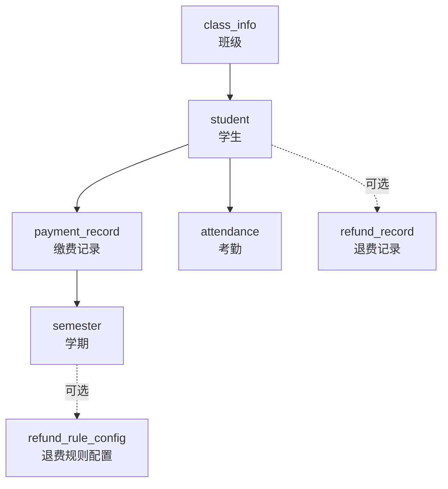
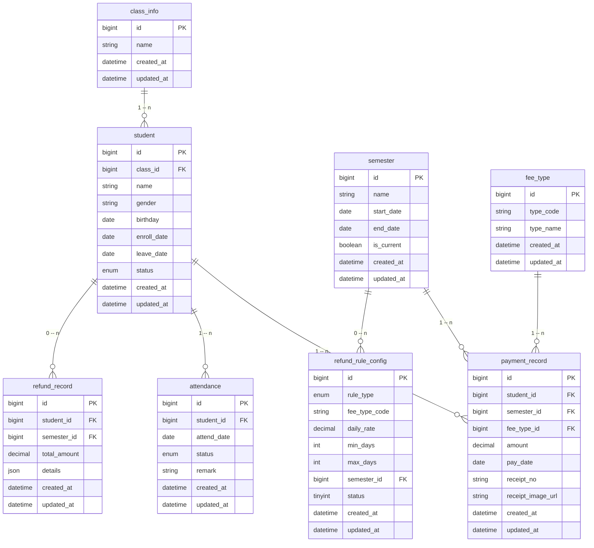
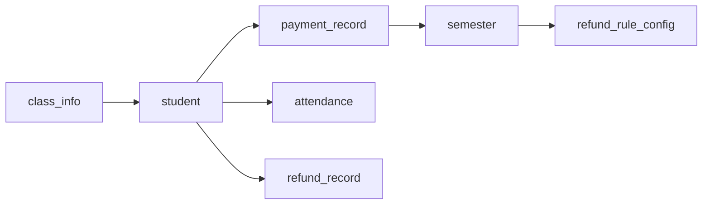

# 数据库设计

<cite>
**本文引用的文件**
- [00-项目概览.md](file://docs/00-项目概览.md)
- [01-数据库设计-退费规则补充.md](file://docs/01-数据库设计-退费规则补充.md)
- [01-数据库设计.md](file://docs/01-数据库设计.md)
- [03-后端接口开发.md](file://docs/03-后端接口开发.md)
- [06-收据收费需求.md](file://docs/06-收据收费需求.md)
</cite>

## 目录
1. [简介](#简介)
2. [项目结构](#项目结构)
3. [核心组件](#核心组件)
4. [架构总览](#架构总览)
5. [详细组件分析](#详细组件分析)
6. [依赖分析](#依赖分析)
7. [性能考虑](#性能考虑)
8. [故障排查指南](#故障排查指南)
9. [结论](#结论)
10. [附录](#附录)

## 简介
本文件面向数据库管理员与开发者，系统化梳理幼儿园管理系统的数据库设计，覆盖核心实体（学生、班级、学期、费用类型、缴费记录、考勤）与退费规则配置表的设计思路、字段定义、约束与索引策略，并给出完整的 ERD 关系图与数据字典。文档同时结合接口与业务规则，明确各表之间的关联关系与外键约束，帮助快速理解与落地实现。

## 项目结构
- 后端技术栈采用 Spring Boot + MyBatis Plus + TiDB/MySQL，接口与数据模型在文档中对齐。
- 数据库层面围绕“班级—学生—学期—费用类型—缴费记录—考勤—退费规则配置—退费记录（可选）”构建主链路。
- 退费计算依赖“考勤连续请假区间 + 可配置退费规则”，可不落库退费金额，也可选落库“退费记录”。

图表来源
- [01-数据库设计.md](file://docs/01-数据库设计.md#L23-L30)
- [03-后端接口开发.md](file://docs/03-后端接口开发.md#L122-L131)
- [03-后端接口开发.md](file://docs/03-后端接口开发.md#L133-L141)
- [03-后端接口开发.md](file://docs/03-后端接口开发.md#L143-L150)
- [03-后端接口开发.md](file://docs/03-后端接口开发.md#L154-L163)
- [03-后端接口开发.md](file://docs/03-后端接口开发.md#L216-L225)
- [03-后端接口开发.md](file://docs/03-后端接口开发.md#L254-L261)
- [01-数据库设计-退费规则补充.md](file://docs/01-数据库设计-退费规则补充.md#L5-L34)

章节来源
- [00-项目概览.md](file://docs/00-项目概览.md#L43-L54)
- [03-后端接口开发.md](file://docs/03-后端接口开发.md#L98-L120)

## 核心组件
- 班级（class_info）：承载学生归属与分班统计。
- 学生（student）：记录在读/离园状态、家长联系方式等。
- 学期（semester）：学期起止时间与当前学期标识。
- 费用类型（fee_type）：费用分类与编码（含 type_code）。
- 缴费记录（payment_record）：按学期、费用类型、学生维度记录应收/实收与收据信息。
- 考勤（attendance）：按日期与班级记录学生出勤状态（出勤/请假/缺勤）。
- 退费规则配置（refund_rule_config）：按规则类型与费用类型配置日均费用与适用天数区间，支持按学期或全局生效。
- 退费记录（refund_record，可选）：可选持久化退费结果快照（学生、学期、金额、明细）。

章节来源
- [03-后端接口开发.md](file://docs/03-后端接口开发.md#L122-L131)
- [03-后端接口开发.md](file://docs/03-后端接口开发.md#L133-L141)
- [03-后端接口开发.md](file://docs/03-后端接口开发.md#L143-L150)
- [03-后端接口开发.md](file://docs/03-后端接口开发.md#L154-L163)
- [03-后端接口开发.md](file://docs/03-后端接口开发.md#L216-L225)
- [03-后端接口开发.md](file://docs/03-后端接口开发.md#L254-L261)
- [01-数据库设计-退费规则补充.md](file://docs/01-数据库设计-退费规则补充.md#L5-L34)

## 架构总览
下图展示核心实体与退费相关表之间的关系，以及退费计算的数据流。

图表来源
- [01-数据库设计.md](file://docs/01-数据库设计.md#L57-L170)
- [01-数据库设计-退费规则补充.md](file://docs/01-数据库设计-退费规则补充.md#L9-L24)

## 详细组件分析

### 班级表（class_info）
- 字段要点
  - id：主键
  - name：班级名称
  - created_at/updated_at：审计字段
- 约束与索引
  - 主键 id
  - 建议对 name 建唯一索引（避免重复）
- 关联关系
  - 1:n 关联学生表

章节来源
- [03-后端接口开发.md](file://docs/03-后端接口开发.md#L122-L131)
- [01-数据库设计.md](file://docs/01-数据库设计.md#L57-L66)

### 学生表（student）
- 字段要点
  - id：主键
  - class_id：外键，指向班级
  - name/gender/birthday：基本信息
  - enroll_date/leave_date：入园/离园日期
  - status：在读/离园
  - created_at/updated_at：审计字段
- 约束与索引
  - 主键 id
  - 建议对 class_id 加索引，对 status 建索引以支持状态筛选
- 关联关系
  - 1:n 关联缴费记录、考勤、可选退费记录

章节来源
- [03-后端接口开发.md](file://docs/03-后端接口开发.md#L154-L163)
- [01-数据库设计.md](file://docs/01-数据库设计.md#L94-L113)

### 学期表（semester）
- 字段要点
  - id：主键
  - name/start_date/end_date：学期名称与起止日期
  - is_current：当前学期标记（保证唯一）
  - created_at/updated_at：审计字段
- 约束与索引
  - 主键 id
  - 建唯一索引于 is_current（保证当前学期唯一）
  - 建索引于 start_date/end_date 以支持范围查询
- 关联关系
  - 1:n 关联缴费记录与退费规则配置（可空）

章节来源
- [03-后端接口开发.md](file://docs/03-后端接口开发.md#L133-L141)
- [01-数据库设计.md](file://docs/01-数据库设计.md#L68-L80)

### 费用类型表（fee_type）
- 字段要点
  - id：主键
  - type_code：费用类型编码（如 meal、education），用于与退费规则映射
  - type_name：费用类型名称
  - created_at/updated_at：审计字段
- 约束与索引
  - 主键 id
  - 建唯一索引于 type_code（避免重复）
- 关联关系
  - 1:n 关联缴费记录

章节来源
- [03-后端接口开发.md](file://docs/03-后端接口开发.md#L143-L150)
- [01-数据库设计.md](file://docs/01-数据库设计.md#L81-L93)

### 缴费记录表（payment_record）
- 字段要点
  - id：主键
  - student_id/semester_id/fee_type_id：外键
  - amount：金额
  - pay_date：缴费日期
  - receipt_no/receipt_image_url：收据编号与图片地址
  - created_at/updated_at：审计字段
- 约束与索引
  - 主键 id
  - 建复合索引：(semester_id, fee_type_id)、(student_id, pay_date)
  - 建索引于 pay_date 以支持按日期范围查询
- 关联关系
  - n:1 关联学生、学期、费用类型

章节来源
- [03-后端接口开发.md](file://docs/03-后端接口开发.md#L216-L225)
- [01-数据库设计.md](file://docs/01-数据库设计.md#L114-L135)

### 考勤表（attendance）
- 字段要点
  - id：主键
  - student_id：外键
  - attend_date：考勤日期
  - status：出勤状态（present/absent/leave）
  - remark：备注
  - created_at/updated_at：审计字段
- 约束与索引
  - 主键 id
  - 建复合索引：(student_id, attend_date) 以支持按学生+日期查询
  - 建索引于 attend_date、status 以支持统计与筛选
- 关联关系
  - n:1 关联学生

章节来源
- [03-后端接口开发.md](file://docs/03-后端接口开发.md#L254-L261)
- [01-数据库设计.md](file://docs/01-数据库设计.md#L136-L152)

### 退费规则配置表（refund_rule_config）
- 字段要点
  - id：主键
  - rule_type：规则类型（LEAVE_5_9 / LEAVE_10_PLUS）
  - fee_type_code：费用类型编码（meal / education）
  - daily_rate：日均费用（元/天）
  - min_days/max_days：最小/最大天数（max_days 为空表示无上限）
  - semester_id：学期 ID（为空表示全局规则）
  - status：启用/禁用
  - created_at/updated_at：审计字段
- 约束与索引
  - 主键 id
  - 唯一性约束：(rule_type, fee_type_code, COALESCE(semester_id, 0)) 以避免同学期/全局重复配置
  - 建索引：(semester_id)、(rule_type)
  - 外键：semester_id 引用 semester(id)
- 关联关系
  - n:1 关联学期（可空）

章节来源
- [01-数据库设计-退费规则补充.md](file://docs/01-数据库设计-退费规则补充.md#L5-L34)
- [01-数据库设计.md](file://docs/01-数据库设计.md#L153-L169)

### 退费记录表（refund_record，可选）
- 字段要点
  - id：主键
  - student_id/semester_id：外键
  - total_amount：总退费金额
  - details：JSON 格式退费明细（费用类型、日均费用、天数、小计等）
  - created_at/updated_at：审计字段
- 约束与索引
  - 主键 id
  - 建复合索引：(student_id, semester_id)
- 关联关系
  - n:1 关联学生、学期

章节来源
- [01-数据库设计-退费规则补充.md](file://docs/01-数据库设计-退费规则补充.md#L41-L41)
- [01-数据库设计.md](file://docs/01-数据库设计.md#L170-L189)

## 依赖分析
- 实体依赖链
  - 班级 → 学生 → 缴费记录 → 学期
  - 学生 → 考勤
  - 学期 → 退费规则配置（可空）
  - 学生 → 退费记录（可选）
- 外键约束
  - student.class_id → class_info.id
  - payment_record.student_id → student.id
  - payment_record.semester_id → semester.id
  - payment_record.fee_type_id → fee_type.id
  - attendance.student_id → student.id
  - refund_rule_config.semester_id → semester.id
  - refund_record.student_id → student.id
  - refund_record.semester_id → semester.id
- 关系图

图表来源
- [01-数据库设计.md](file://docs/01-数据库设计.md#L23-L30)

章节来源
- [01-数据库设计.md](file://docs/01-数据库设计.md#L23-L30)

## 性能考虑
- 索引策略
  - 缴费记录：按学期/费用类型聚合统计时，建议在 (semester_id, fee_type_id) 建复合索引；按日期范围查询时在 pay_date 建索引。
  - 考勤统计：按学生+日期查询时在 (student_id, attend_date) 建复合索引；按日期/状态查询时在 attend_date、status 建索引。
  - 退费规则：按学期/规则类型查询时在 (semester_id)、(rule_type) 建索引。
- 查询模式
  - 收费汇总：按 semester_id 聚合 amount，建议在 semester_id 上建立高效索引。
  - 退费计算：按学生与学期过滤考勤连续请假区间，再匹配退费规则，建议在 (student_id, attend_date) 与 (semester_id, rule_type) 建索引。
- 数据量与分区
  - 若数据量持续增长，可考虑按 pay_date 或 attend_date 进行水平分区，提升大范围扫描效率。

## 故障排查指南
- 常见问题与处理
  - 当前学期唯一性冲突：设置 is_current 时，需先将旧记录置为非当前，再更新新记录，必要时在应用层加互斥锁或在数据库层加唯一约束。
  - 退费规则重复配置：通过唯一性约束 (rule_type, fee_type_code, COALESCE(semester_id, 0)) 防止重复；若需修改，先删除旧规则再插入新规则。
  - 考勤连续请假区间不正确：确认 status IN ('leave','absent') 的连续区间判定逻辑，确保按日期排序与相邻日期差为 1 天的合并规则正确实现。
  - 退费金额不一致：核对 fee_type.type_code 与 refund_rule_config.fee_type_code 的映射一致性，以及按学期优先、全局回退的规则匹配顺序。
- 排查步骤
  - 核对退费规则配置：确认 rule_type、fee_type_code、min_days/max_days、semester_id 是否符合预期。
  - 核对考勤数据：确认 attend_date、status、student_id 的完整性与连续请假区间划分。
  - 核对费用类型映射：确认 fee_type.type_code 与 fee_type_id 的一致性。
  - 核对学期范围：确认查询的 semester_id 是否在目标学期范围内。

章节来源
- [01-数据库设计-退费规则补充.md](file://docs/01-数据库设计-退费规则补充.md#L43-L48)
- [06-收据收费需求.md](file://docs/06-收据收费需求.md#L138-L148)

## 结论
本设计以“班级—学生—学期—费用类型—缴费记录—考勤—退费规则配置—退费记录（可选）”为主线，既满足收费汇总与退费计算的业务需求，又通过合理的索引与外键约束保障查询性能与数据一致性。退费规则配置表支持按学期与全局两级配置，满足灵活的业务调整需求。建议在生产环境实施前完成索引与唯一性约束的最终校验，并在应用层完善并发控制与边界条件处理。

## 附录

### 数据字典与字段说明
- 班级（class_info）
  - id：主键
  - name：班级名称
  - created_at/updated_at：审计时间
- 学生（student）
  - id：主键
  - class_id：外键，指向班级
  - name/gender/birthday：基本信息
  - enroll_date/leave_date：入园/离园日期
  - status：在读/离园
  - created_at/updated_at：审计时间
- 学期（semester）
  - id：主键
  - name：学期名称
  - start_date/end_date：起止日期
  - is_current：当前学期标记
  - created_at/updated_at：审计时间
- 费用类型（fee_type）
  - id：主键
  - type_code：费用类型编码（meal/education）
  - type_name：费用类型名称
  - created_at/updated_at：审计时间
- 缴费记录（payment_record）
  - id：主键
  - student_id/semester_id/fee_type_id：外键
  - amount：金额
  - pay_date：缴费日期
  - receipt_no/receipt_image_url：收据编号与图片地址
  - created_at/updated_at：审计时间
- 考勤（attendance）
  - id：主键
  - student_id：外键
  - attend_date：考勤日期
  - status：出勤状态（present/absent/leave）
  - remark：备注
  - created_at/updated_at：审计时间
- 退费规则配置（refund_rule_config）
  - id：主键
  - rule_type：规则类型（LEAVE_5_9 / LEAVE_10_PLUS）
  - fee_type_code：费用类型编码（meal / education）
  - daily_rate：日均费用（元/天）
  - min_days/max_days：最小/最大天数
  - semester_id：学期 ID（为空表示全局）
  - status：启用/禁用
  - created_at/updated_at：审计时间
- 退费记录（refund_record，可选）
  - id：主键
  - student_id/semester_id：外键
  - total_amount：总退费金额
  - details：JSON 退费明细
  - created_at/updated_at：审计时间

### 业务规则与数据验证
- 收费汇总
  - R1：按 semester_id 汇总 payment_record.amount
- 退费计算
  - R2：连续 5–9 天：仅退伙食费 = 12.7 × 天数
  - R3：连续 10 天及以上：退保教费 = 66.3 × 天数，退伙食费 = 61.7 × 天数
  - R4：日均费用可配置
  - R5：连续请假由 attendance 中 leave/absent 连续区间判定
  - R6：不足 5 天不退费
- 数据验证
  - 唯一性：type_code、is_current（当前学期唯一）、退费规则组合唯一
  - 外键：所有外键引用均存在且有效
  - 状态枚举：status/present/absent/leave

章节来源
- [06-收据收费需求.md](file://docs/06-收据收费需求.md#L138-L148)
- [01-数据库设计-退费规则补充.md](file://docs/01-数据库设计-退费规则补充.md#L43-L48)