# 项目概览

<cite>
**本文档引用的文件**
- [00-项目概览.md](file://docs/00-项目概览.md)
- [01-数据库设计-退费规则补充.md](file://docs/01-数据库设计-退费规则补充.md)
- [03-后端接口开发.md](file://docs/03-后端接口开发.md)
- [06-收据收费需求.md](file://docs/06-收据收费需求.md)
</cite>

## 目录
1. [项目简介](#项目简介)
2. [项目结构](#项目结构)
3. [核心组件](#核心组件)
4. [架构概览](#架构概览)
5. [详细组件分析](#详细组件分析)
6. [依赖关系分析](#依赖关系分析)
7. [性能考虑](#性能考虑)
8. [故障排除指南](#故障排除指南)
9. [结论](#结论)

## 项目简介

幼儿园管理系统是一个专为幼儿园运营设计的数字化管理平台，旨在提升教育机构的管理效率和服务质量。该项目采用现代化的技术栈和架构设计，为用户提供完整的幼儿园管理解决方案。

### 项目背景与价值

随着教育信息化的发展，传统的手工管理模式已无法满足现代幼儿园的管理需求。本系统通过数字化手段解决以下痛点：

- **管理效率提升**：自动化处理学生信息、缴费管理、考勤统计等日常事务
- **财务透明度**：提供清晰的收费记录和退费计算，增强家长信任
- **数据驱动决策**：通过统计面板和报表分析，辅助管理层制定策略
- **成本控制**：优化资源配置，降低人工成本

### 核心目标

1. **全流程数字化管理**：覆盖从学生入学到离园的完整生命周期
2. **实时数据同步**：确保各模块间数据的一致性和实时性
3. **用户体验优化**：提供直观易用的操作界面和高效的管理工具
4. **扩展性设计**：支持未来功能扩展和业务发展需求

## 项目结构

项目采用前后端分离的架构设计，将前端界面与后端服务完全解耦，提高了系统的可维护性和扩展性。

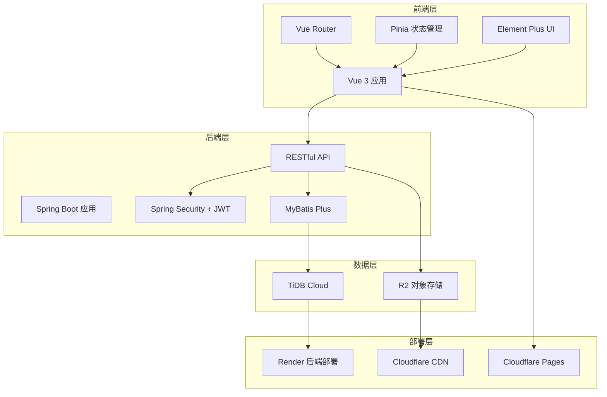

**图表来源**
- [00-项目概览.md](file://docs/00-项目概览.md#L34-L42)
- [03-后端接口开发.md](file://docs/03-后端接口开发.md#L1-L20)

### 技术栈选择

#### 后端技术栈

| 技术 | 版本 | 选择理由 |
|------|------|----------|
| Spring Boot 3.2.x | 3.2.x | 最新稳定版本，性能优异，生态完善 |
| MyBatis Plus 3.5.x | 3.5.x | 简化数据库操作，提高开发效率 |
| Spring Security 6.x | 6.x | 强大的安全框架，支持JWT |
| JWT 0.12.x | 0.12.x | 无状态认证，适合分布式部署 |
| TiDB Cloud | - | 云原生数据库，高可用性 |
| Cloudflare R2 | - | 边缘存储，全球加速 |

#### 前端技术栈

| 技术 | 版本 | 选择理由 |
|------|------|----------|
| Vue 3.x | 3.x | 最新版本，Composition API，更好的性能 |
| Vite 5.x | 5.x | 构建速度快，开发体验优秀 |
| Element Plus 2.x | 2.x | 完善的UI组件库，符合管理后台风格 |
| Axios 1.x | 1.x | 流行的HTTP客户端库 |
| Vue Router 4.x | 4.x | 官方路由管理器 |
| Pinia 2.x | 2.x | Vue官方推荐的状态管理库 |

**章节来源**
- [00-项目概览.md](file://docs/00-项目概览.md#L9-L42)

## 核心组件

系统围绕六大核心功能模块构建，每个模块都有明确的业务职责和用户场景。

### 登录认证模块

登录认证是整个系统的基础安全组件，采用JWT无状态认证机制，确保系统的安全性。

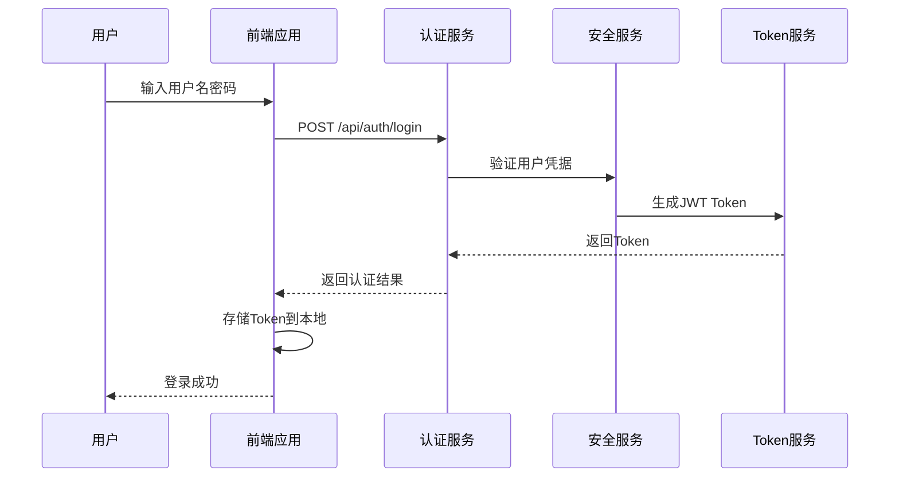

**图表来源**
- [03-后端接口开发.md](file://docs/03-后端接口开发.md#L102-L121)

### 学生管理模块

学生管理模块提供完整的学籍信息管理功能，支持学生基本信息维护、状态管理和班级分配。

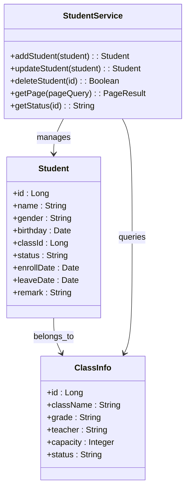

**图表来源**
- [03-后端接口开发.md](file://docs/03-后端接口开发.md#L154-L196)

### 缴费收据管理模块

缴费收据管理模块实现了完整的收费流程，包括收据上传、存储和管理功能。

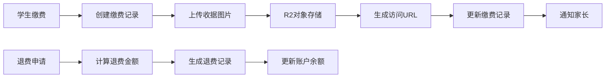

**图表来源**
- [03-后端接口开发.md](file://docs/03-后端接口开发.md#L216-L252)
- [06-收据收费需求.md](file://docs/06-收据收费需求.md#L40-L76)

### 考勤联动退费模块

考勤联动退费模块通过分析学生的出勤数据，自动计算应退费用，确保退费的准确性和及时性。

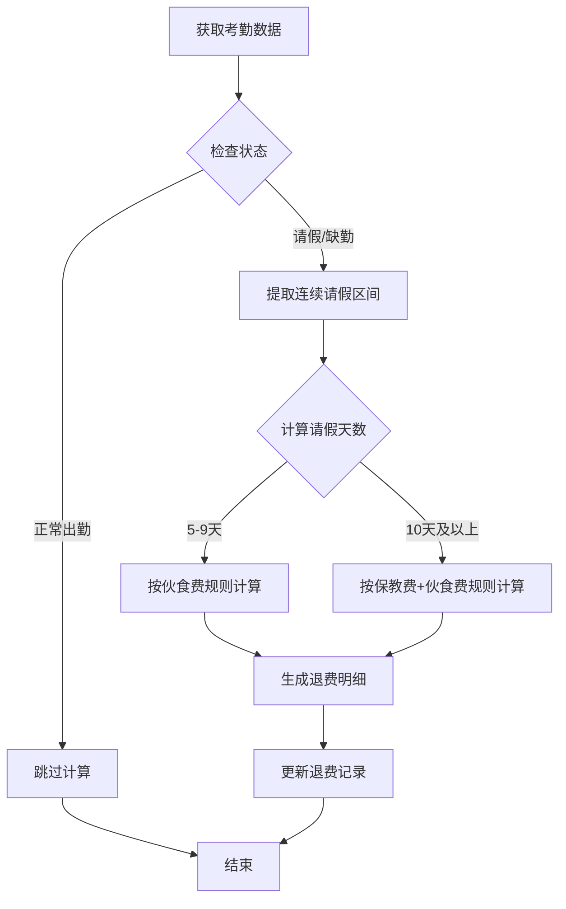

**图表来源**
- [01-数据库设计-退费规则补充.md](file://docs/01-数据库设计-退费规则补充.md#L36-L48)
- [06-收据收费需求.md](file://docs/06-收据收费需求.md#L57-L76)

### 统计面板模块

统计面板提供多维度的数据分析和可视化展示，帮助管理者做出数据驱动的决策。

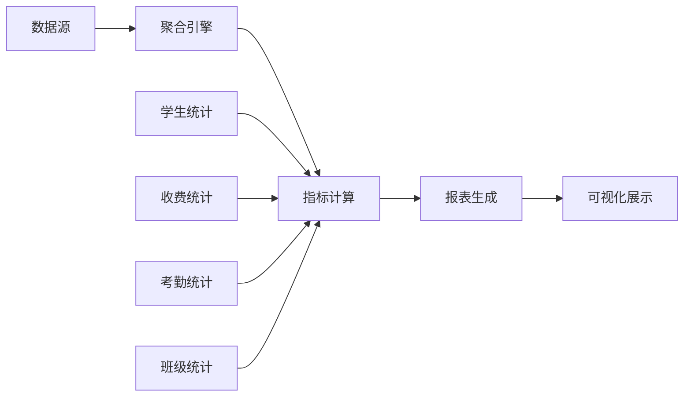

**图表来源**
- [03-后端接口开发.md](file://docs/03-后端接口开发.md#L360-L387)

**章节来源**
- [00-项目概览.md](file://docs/00-项目概览.md#L43-L54)

## 架构概览

系统采用微服务化的架构思想，虽然目前以单体应用形式部署，但代码结构和接口设计都遵循了微服务的最佳实践。

### 整体架构设计

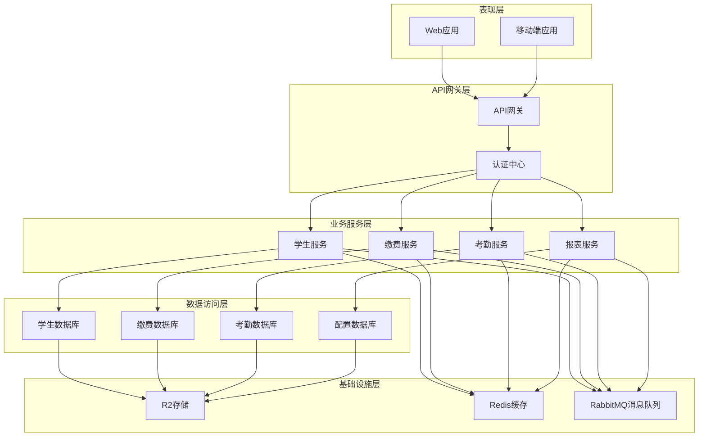

**图表来源**
- [03-后端接口开发.md](file://docs/03-后端接口开发.md#L1-L20)

### 数据流设计

系统采用事件驱动的数据流设计，确保各模块间的数据一致性和实时性。

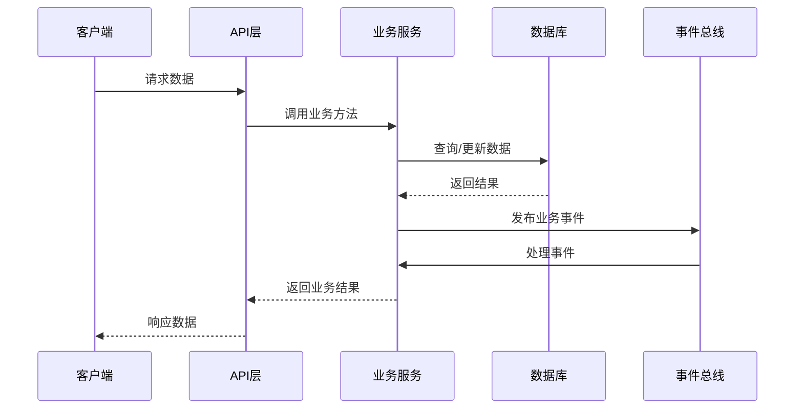

**图表来源**
- [03-后端接口开发.md](file://docs/03-后端接口开发.md#L23-L80)

## 详细组件分析

### 认证与授权机制

系统采用JWT（JSON Web Token）实现无状态认证，结合Spring Security提供完善的授权控制。

#### JWT认证流程

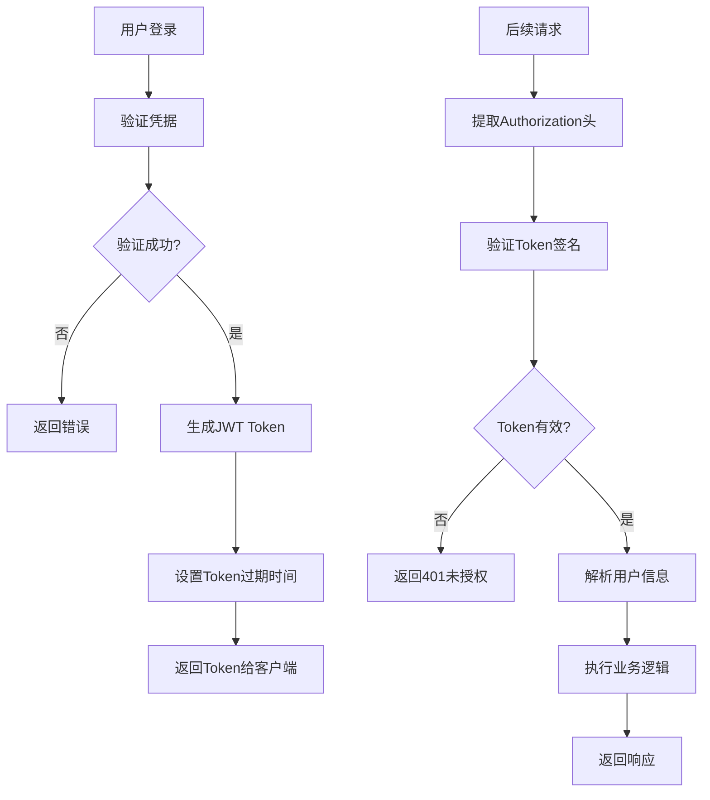

**图表来源**
- [03-后端接口开发.md](file://docs/03-后端接口开发.md#L30-L52)

#### 权限控制策略

系统采用基于角色的访问控制（RBAC），支持不同用户角色的权限管理。

| 角色 | 权限范围 | 功能限制 |
|------|----------|----------|
| ADMIN | 系统管理员 | 完全访问权限 |
| TEACHER | 教师 | 查看/编辑所带班级学生 |
| ACCOUNTANT | 财务人员 | 缴费/退费相关操作 |
| PARENT | 家长 | 查看自己孩子相关信息 |

**章节来源**
- [03-后端接口开发.md](file://docs/03-后端接口开发.md#L30-L52)

### 数据模型设计

系统采用关系型数据库设计，通过合理的表结构和索引设计确保数据的完整性和查询性能。

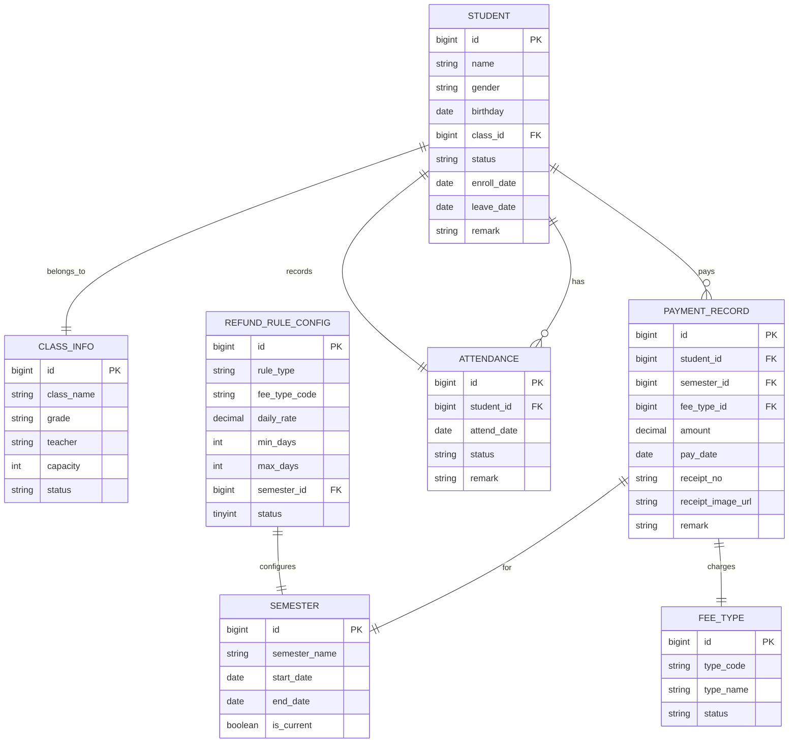

**图表来源**
- [01-数据库设计-退费规则补充.md](file://docs/01-数据库设计-退费规则补充.md#L9-L34)

**章节来源**
- [01-数据库设计-退费规则补充.md](file://docs/01-数据库设计-退费规则补充.md#L36-L48)

### 接口设计规范

系统采用RESTful API设计原则，提供统一的接口规范和响应格式。

#### 统一响应结构

所有API接口都遵循统一的响应格式，确保前后端交互的一致性。

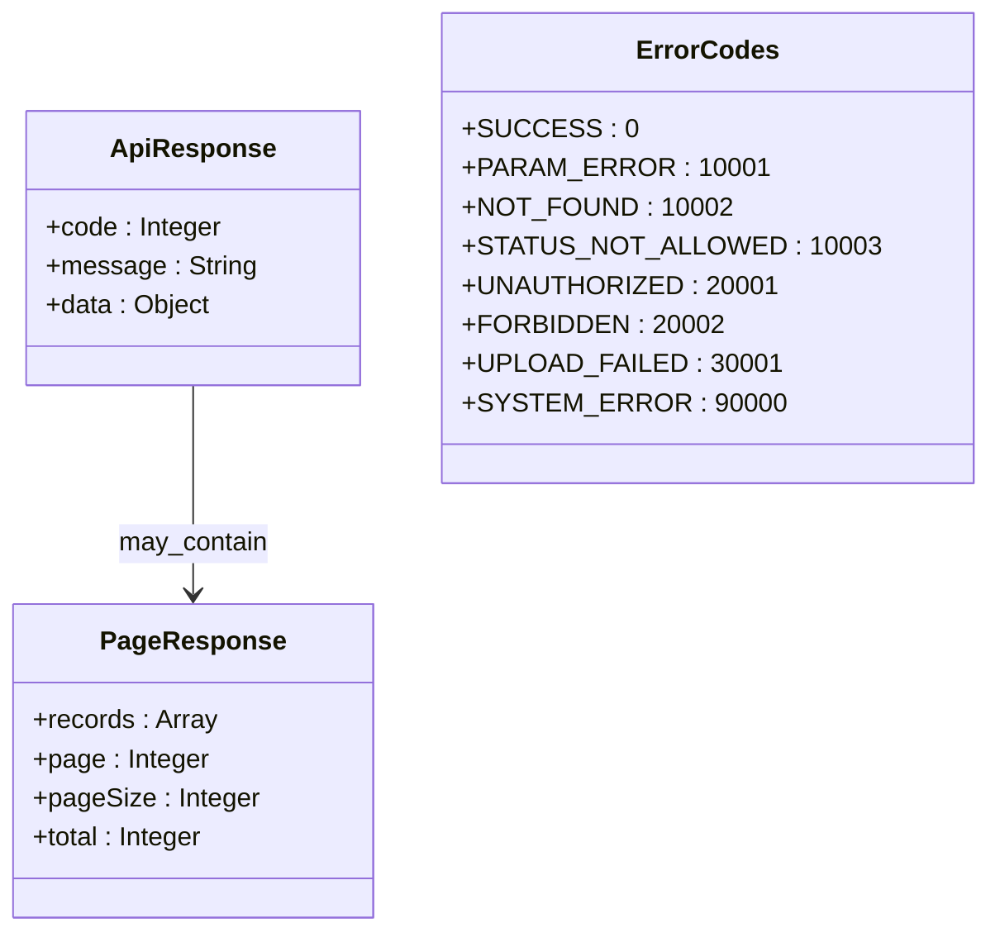

**图表来源**
- [03-后端接口开发.md](file://docs/03-后端接口开发.md#L36-L95)

#### 接口分类与权限

系统按照功能模块对API进行分类，并为每个接口定义相应的权限要求。

| 模块 | 接口数量 | 公开接口 | 需认证 | 需权限 |
|------|----------|----------|--------|--------|
| 认证 | 1 | 1 | 0 | 0 |
| 班级管理 | 4 | 0 | 4 | 0 |
| 学期管理 | 5 | 0 | 5 | 0 |
| 费用类型 | 4 | 0 | 4 | 0 |
| 学生管理 | 6 | 0 | 6 | 0 |
| 缴费管理 | 6 | 0 | 6 | 0 |
| 考勤管理 | 4 | 0 | 4 | 0 |
| 统计分析 | 3 | 0 | 3 | 0 |
| **总计** | **33** | **1** | **32** | **0** |

**章节来源**
- [03-后端接口开发.md](file://docs/03-后端接口开发.md#L98-L387)

## 依赖关系分析

系统各组件间的依赖关系清晰明确，遵循单一职责原则和依赖倒置原则。

### 技术依赖关系

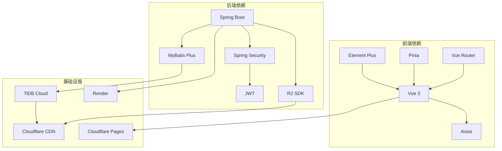

**图表来源**
- [00-项目概览.md](file://docs/00-项目概览.md#L9-L42)

### 数据依赖关系

系统通过清晰的数据依赖关系确保业务逻辑的正确执行。

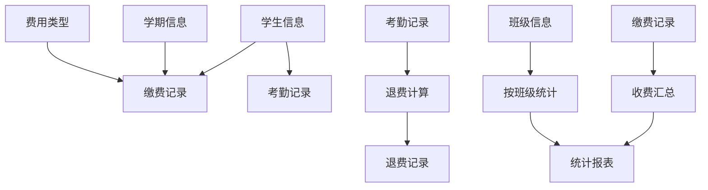

**图表来源**
- [06-收据收费需求.md](file://docs/06-收据收费需求.md#L83-L88)

**章节来源**
- [03-后端接口开发.md](file://docs/03-后端接口开发.md#L1-L20)

## 性能考虑

系统在设计时充分考虑了性能优化，采用多种技术和策略确保系统的高效运行。

### 数据库性能优化

1. **索引优化**：为常用查询字段建立合适的索引
2. **查询优化**：避免N+1查询问题，使用批量查询
3. **分页优化**：大数据量场景下使用游标分页
4. **缓存策略**：热点数据使用Redis缓存

### 接口性能优化

1. **响应压缩**：启用Gzip压缩减少传输数据量
2. **并发控制**：合理设置线程池大小
3. **超时控制**：设置合理的请求超时时间
4. **重试机制**：对外部依赖添加重试逻辑

### 前端性能优化

1. **懒加载**：按需加载组件和路由
2. **资源压缩**：构建时压缩CSS和JavaScript
3. **CDN加速**：静态资源使用CDN分发
4. **缓存策略**：合理设置浏览器缓存

## 故障排除指南

### 常见问题诊断

#### 认证相关问题

| 问题现象 | 可能原因 | 解决方案 |
|----------|----------|----------|
| 登录失败 | 用户名或密码错误 | 检查凭据有效性 |
| Token过期 | Token有效期已过 | 重新登录获取新Token |
| 权限不足 | 用户角色权限不够 | 检查用户角色配置 |
| 401未授权 | 缺少Authorization头 | 确认Token正确传递 |

#### 数据库连接问题

| 问题现象 | 可能原因 | 解决方案 |
|----------|----------|----------|
| 连接超时 | 网络不稳定 | 检查网络连接和防火墙设置 |
| 连接池耗尽 | 并发过高 | 调整连接池配置 |
| SQL语法错误 | 查询语句有问题 | 检查SQL语句和参数绑定 |
| 死锁 | 事务冲突 | 优化事务设计和锁策略 |

#### 文件上传问题

| 问题现象 | 可能原因 | 解决方案 |
|----------|----------|----------|
| 上传失败 | 文件过大 | 检查文件大小限制 |
| 格式不支持 | MIME类型不匹配 | 验证文件类型 |
| 存储失败 | R2存储异常 | 检查R2配置和权限 |
| URL访问失败 | CDN缓存问题 | 清理CDN缓存 |

**章节来源**
- [03-后端接口开发.md](file://docs/03-后端接口开发.md#L83-L95)

### 调试技巧

1. **日志分析**：通过详细的日志信息定位问题
2. **监控告警**：设置关键指标监控和告警
3. **性能分析**：使用性能分析工具识别瓶颈
4. **单元测试**：编写充分的单元测试确保代码质量

## 结论

幼儿园管理系统项目通过采用现代化的技术栈和架构设计，为教育机构提供了完整的数字化管理解决方案。系统具有以下显著优势：

### 技术优势

1. **技术先进性**：采用Spring Boot 3.2.x和Vue 3等最新技术栈
2. **架构合理性**：前后端分离设计，符合现代Web应用发展趋势
3. **扩展性强**：模块化设计支持功能扩展和业务发展
4. **部署灵活**：支持云端部署，具备良好的可维护性

### 业务价值

1. **提升管理效率**：自动化处理日常管理事务，减少人工成本
2. **增强数据透明度**：提供完整的数据记录和统计分析
3. **改善用户体验**：简洁直观的操作界面，良好的交互体验
4. **支持决策制定**：通过数据分析为管理层提供决策依据

### 发展前景

系统采用微服务化的架构思想，为未来的功能扩展和技术升级奠定了良好基础。随着教育信息化的不断发展，该系统将在提升教育质量和服务水平方面发挥重要作用。

通过持续的优化和完善，幼儿园管理系统将成为教育机构数字化转型的重要工具，为推动教育事业的发展贡献力量。